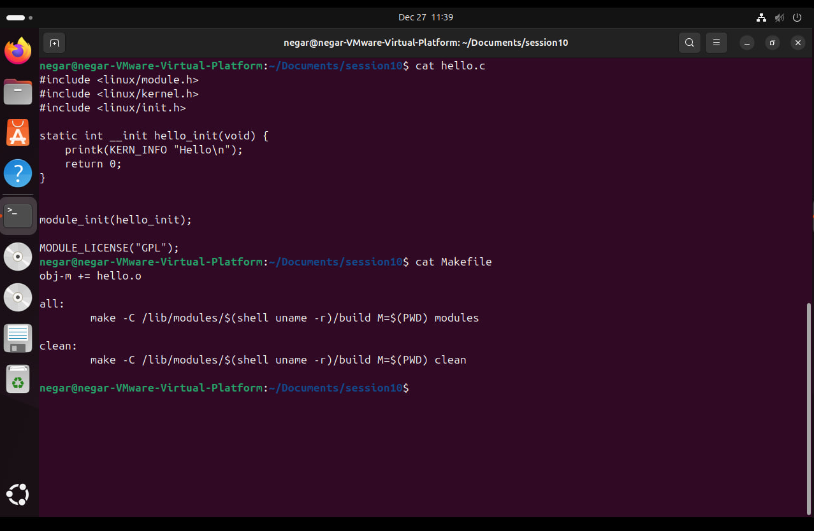
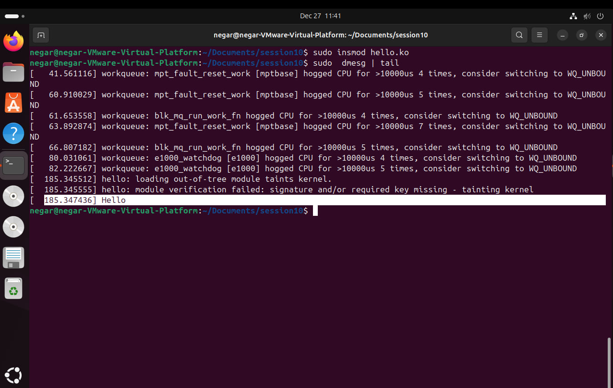
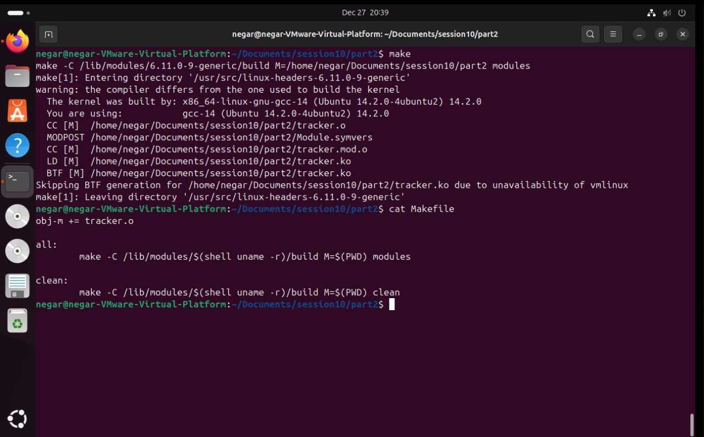
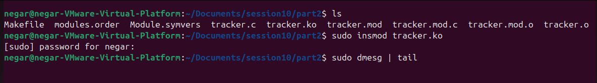
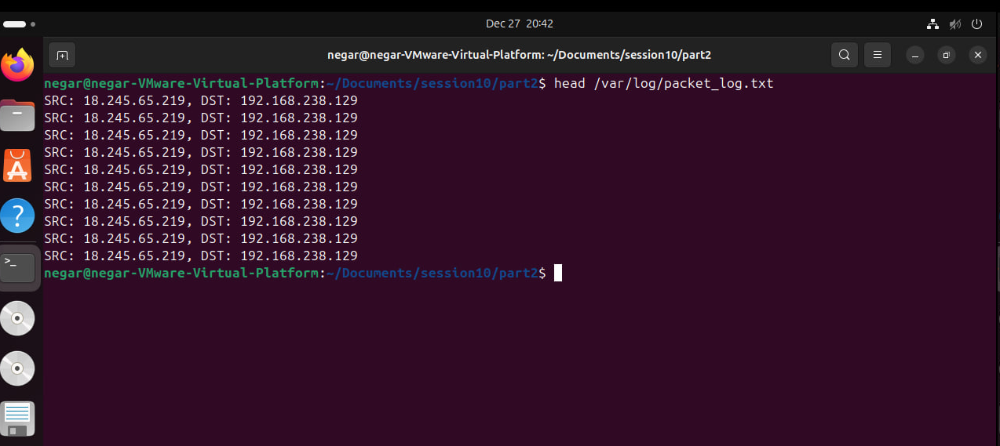
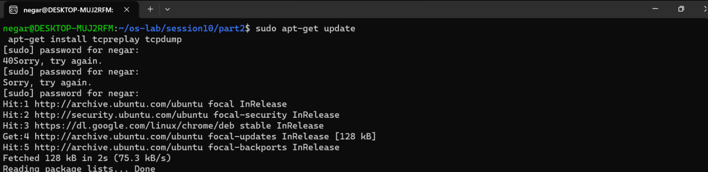
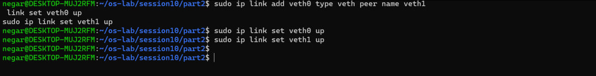
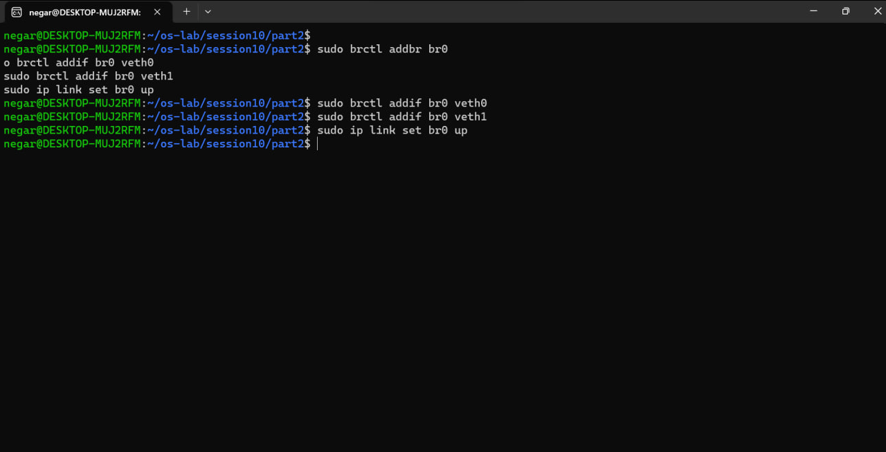
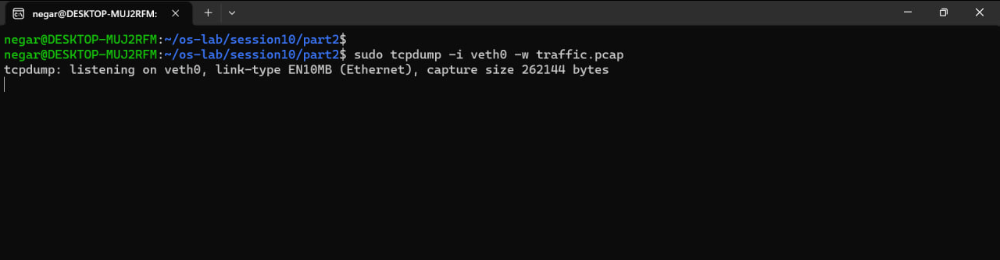
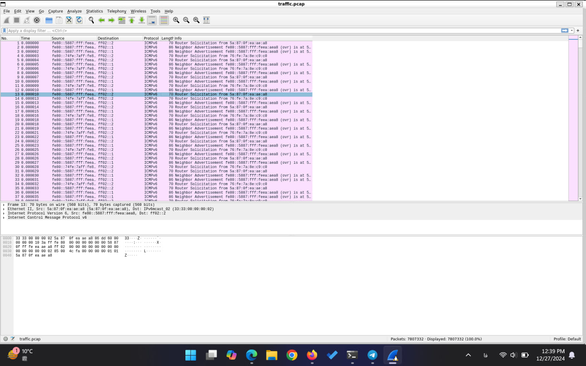

# Practice 10: Device drivers

Session 10. Official instructions: [session-10.md](https://github.com/Sharif-OS-Lab/session-10/blob/main/session-10.md)

Two experiments. The first (10.3) is a hello-world driver: a kernel module that prints a message to the kernel log when it is loaded. The second (10.4) is a network sniffing driver, which I did two ways, as a kernel module registering a netfilter hook that logs the source and destination of every packet, and from user space with a veth pair, `tcpdump` and Wireshark.

Both modules are listed in full in the report below rather than kept as separate files here. They sit in the packet path, so load them only in a virtual machine you can throw away.

---

Student Name of member 1: `Negar Babashah`

Student Name of member 2: `Iman Mohammadi`

- [x] Read Session Contents.

## Section 10.3
- [x] "Hello World" linux driver
  
  - [x] ابتدا فایل hello.c را می‌سازیم که قرار است در هسته اجرا شود. از هدر module.h هم استفاده می‌کنیم. 
      یک فایل Makefile هم می‌سازیم که در تصاویر محتوای آن مشخص است. پس از آن دستور make را می‌زنیم تا ماژول‌ها ساخته شوند. سپس، با استفاده از دستور insmod hello.ko، برنامه را به فضای کرنل اضافه می‌کنیم. به این صورت ماژول hello به لیست ماژول‌های فعال کرنل اضافه می‌شود.
  - [x] کد فایل hello.c به شرح زیر است:
  ```c
  #include <linux/module.h>
  #include <linux/kernel.h>
  #include <linux/init.h>
  
  static int __init hello_init(void) {
      printk(KERN_INFO "Hello\n");
      return 0;
  }
  
  module_init(hello_init);
  MODULE_LICENSE("GPL");
  ```

  نکته: در این کد فقط `module_init` را نوشته‌ام و `module_exit` ندارد، پس بعد از `insmod` نمی‌شود ماژول را با `rmmod` برداشت. کد را همان طور که تحویل داده‌ام نگه داشته‌ام.


    - [x]  تصاویر اجرا:
 



    

## Section 10.4
- [x] Network Sniffing Driver 

  - [x]  گوش دادن به اطلاعات شبکه را به دو صورت انجام می‌دهیم.
     روش اول از netfilter استفاده می‌کند که در دستور کار هم آمده است و یک ماژولی اضافه می‌کنیم که در سطح کرنل اجرا می‌شود. در روش دوم که در سطح کاربر اجرا می‌شود از وایرشارک و یک سری پکت دیگر برای خواندن و ذخیره‌ی ارتباطات شبکه استفاده می‌کنیم. 

  - [x]  کد این بخش به این صورت است که ساختار آن خیلی مشابه با قسمت ۱ است.
  
  ```c

  #include <linux/module.h>
  #include <linux/kernel.h>
  #include <linux/netfilter.h>
  #include <linux/netfilter_ipv4.h>
  #include <linux/skbuff.h>
  #include <linux/ip.h>
  #include <linux/fs.h>
  #include <linux/uaccess.h>
  
  static struct nf_hook_ops netfilter_ops;
  
  void log_packet(const char *data);
  
  void log_packet(const char *data) {
      struct file *file;
      loff_t pos = 0;
      file = filp_open("/var/log/packet_log.txt", O_WRONLY | O_CREAT | O_APPEND, 0644);
      if (!IS_ERR(file)) {
          kernel_write(file, data, strlen(data), &pos);
          filp_close(file, NULL);
      } else {
          printk(KERN_ERR "%ld\n", PTR_ERR(file));
      }
  }
  
  static unsigned int packet_handler(void *priv, struct sk_buff *skb, const struct nf_hook_state *state) {
      struct iphdr *ip_header;
      char log_entry[256];
      if (!skb)
          return NF_ACCEPT;
      ip_header = ip_hdr(skb);
      if (ip_header) {
          snprintf(log_entry, sizeof(log_entry), "SRC: %pI4, DST: %pI4\n", &ip_header->saddr, &ip_header->daddr);
          log_packet(log_entry);
      }
      return NF_ACCEPT;
  }
  
  static int __init vnet_init(void) {
      netfilter_ops.hook = packet_handler;
      netfilter_ops.pf = PF_INET;
      netfilter_ops.hooknum = NF_INET_PRE_ROUTING;
      netfilter_ops.priority = NF_IP_PRI_FIRST;
      nf_register_net_hook(&init_net, &netfilter_ops);
      printk(KERN_INFO "My driver init\n");
      return 0;
  }
  
  static void __exit vnet_exit(void) {
      nf_unregister_net_hook(&init_net, &netfilter_ops);
      printk(KERN_INFO "My driver exit\n");
  }
  
  
  module_init(vnet_init);
  module_exit(vnet_exit);
  
  MODULE_LICENSE("GPL");
  ```

  نکته: `log_packet` برای هر پکت فایل را با `filp_open` باز می‌کند و می‌نویسد، ولی `packet_handler` روی هوک `NF_INET_PRE_ROUTING` اجرا می‌شود که context آن اجازه‌ی خوابیدن ندارد. روی کرنلی که `CONFIG_DEBUG_ATOMIC_SLEEP` روشن باشد این کار هشدار می‌دهد. کد را همان طور که تحویل داده‌ام نگه داشته‌ام.

  - [x] اجرای کد و مراحل اضافه کردن ماژول به کرنل (مشابه بخش ۱ است):
      




خروجی‌ها هم به این صورت هستند:


و به این ترتیب ارتباطات شبکه را توانستیم ببینیم.

  در روش دوم ابتدا پکیج‌های مورد نیاز برای این کار را نصب می‌کنیم. که یکی  tcpreplay است که برای ارسال ترافیک شبکه به درایور مجازی استفاده می‌شود، یکی دیگر هم tcpdump است که برای گوش دادن به ترافیک شبکه باید استفاده کنیم. 
      

  حال باید درایور مجازی را ایجاد کنیم. برای این کار از دستور ip استفاده می‌کنیم به این صورت:


حال برای گوش دادن به ترافیک شبکه یک bridge شبکه به نام br0 درست می‌کنیم و رابط‌های مجازی veth0 و veth1 را هم اضافه می‌کنیم. سپس br0 را فعال می‌کنیم.


در نهایت با استفاده از دستور tcpdump به ترافیک گوش می‌دهیم و خروجی آن را در یک فایل pcap می‌ریزیم.


حال می‌توان محتوای فایل را با استفاده از وایرشارک باز کرد (دستور wireshark traffic.pcap)



  - [x]  کدی در این قسمت نوشته نشده است ولی دستورات اجرا شده به ترتیب زیر هستند:
 
  ```bash
    sudo apt-get install tcpreplay tcpdump
    
    sudo ip link add veth0 type veth peer name veth1
    sudo ip link set veth0 up
    sudo ip link set veth1 up
   
    sudo brctl addbr br0
    sudo brctl addif br0 veth0
    sudo brctl addif br0 veth1
    sudo ip link set br0 up
    
    sudo tcpdump -i veth0 -w traffic.pcap
    sudo tcpreplay -i veth1 traffic.pcap
    wireshark traffic.pcap
  ```

