Student Name of member 1: Negar Babashah

Student Name of member 2: Iman Mohammadi

- [x] Read Session Contents.

### Section 3.3.1
- [x] Investigate the /proc/ directory
    1. [x] 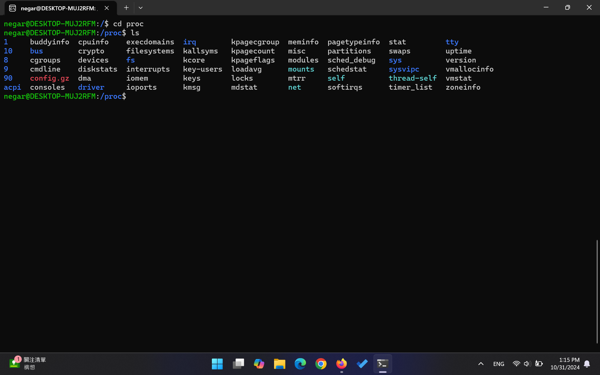

### Section 3.3.2

- [x] Do 5 subtasks from 1 to 5:
    1. [x] 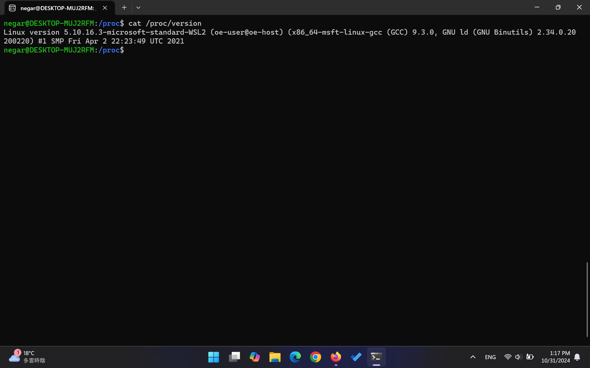
    2. [x] 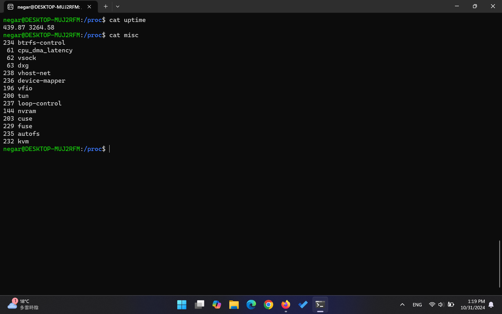
    3. [x] 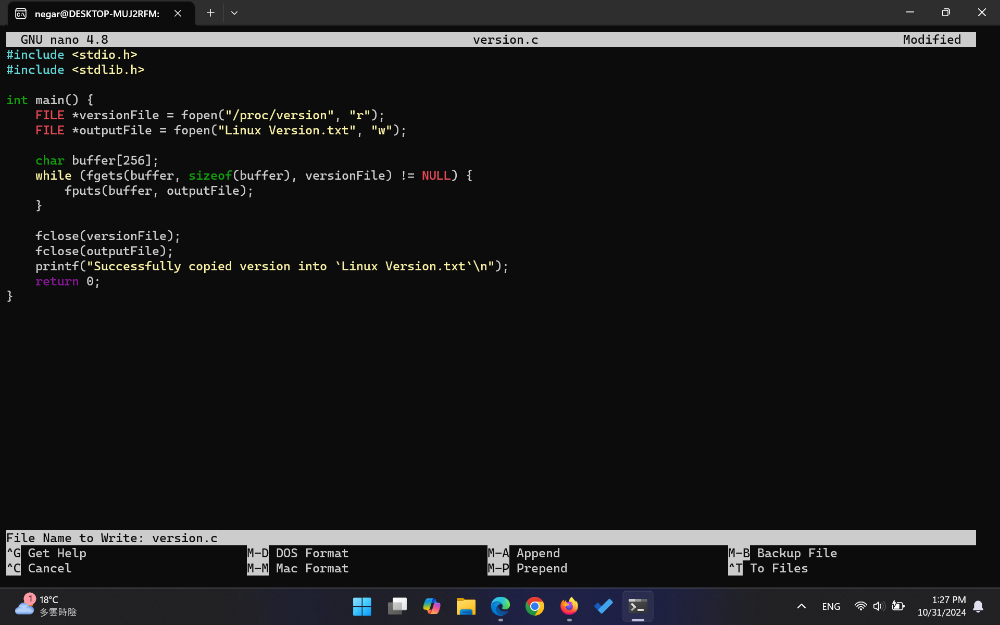
    4. [x] 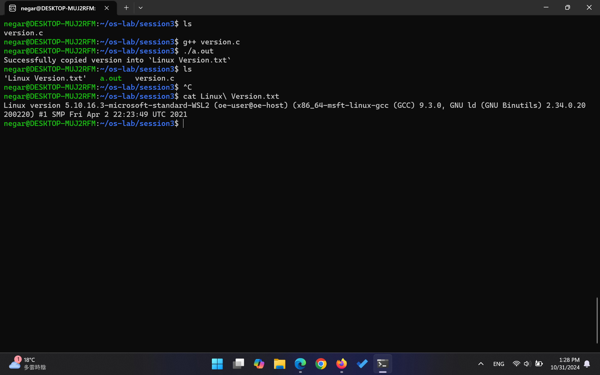
    5. [x] به ارور Permission Denied می‌خوریم.
           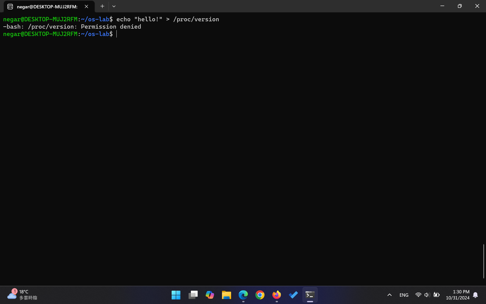

## Section 3.3.3

- [x] Write (in English or Persian) about each file in /proc/(PID) directory:
    
    1. این فایل حاوی آرگومان‌های command line ای است که برای فراخواندن پردازه استفاده شده‌اند. در مثالی که من بررسی کردم، عبارت /init نوشته شده بود.
    
    2. محتوای environ نشان‌دهنده‌ی محیط یا environmentای است که موقعی که پراسس با execv می‌خواست اجرا شود وجود داشت. در مثالی که من بررسی کردم عبارت WSL2_CROSS_DISTRO=/wslNIceCn نوشته شده بود چون روی wsl در حال اجرا است. 
    
    3. `فایل stat حاوی اطلاعاتی درباره‌ی status پردازه است. هر یک از خروجی‌های آن به ترتیب یک معنی دارند. اولی شماره‌ی پردازه یا pid است، سپس comm (اسم فایل executable)، state (وضعیت پردازه. مثلا Running یا Sleeping)، ppid (آیدی parent) و غیره است.
    محتوای stat در مثالی که من بررسی کردم به این صورت بود:`
    ‍`   8 (init) S 1 8 8 0 -1 4211008 18 0 0 0 0 0 0 0 20 0 1 0 280 2215936 91 18446744073709551615 2468640 3466458 140726095690480 0 0 0 65536 2147024638 65536 0 0 0 17 0 0 0 0 0 0 3545504 3548384 30887936 140726095695823 140726095695829 140726095695829 140726095695858 0`
   
    4. فایل status اکثر اطلاعات موجود در فایل stat و statm را می‌دهد به صورتی که human readable باشد (یعنی نام فیلد را هم می‌نویسد). 
    
    5. فایل statm اطلاعاتی درمورد memory usage می‌دهد. واحد اندازه‌گیری آن هم page است. ۷ مقدار خروجی مرتبط حجم حافظه‌های مربوط به size, resident, shared, text, lib, data, dt دارد. که البته گویا از ورژنی به بعد از لینوکس، مقدار‌های dt, lib استفاده نمی‌شوند و همواره ۰ هستند. در مثالی که من بررسی کردم، خروجی به این صورت بود: 541 91 0 245 0 198 0
    
    6. کاربرد cwd به صورت symbolic link است. به این صورت که می‌توان عبارت cd /proc/pid/cwd; /bin/pwd را وارد کرد و سپس به دایرکتوری مربوط به proc/pid می‌رویم و آدرس هم چاپ می‌شود.
    
    7. فایل exe هم یک symbolic link است که به فایل executable پردازه لینک می‌کند و به فایل باینری‌ای که پردازه را اجرا کرده است اشاره می‌کند. محتوای فایل هم encode شده است. برای من دستور readlink /proc/8/exe خروجی‌ای نداشت ولی خروجی دستور readlink /proc/10/exe برابر بود با /usr/bin/bash
    
    8. فایل root هم یک symbolic link به دایرکتوری root برای پردازه است. در مثال من با وارد کردن دستور ls -l /proc/8/root ، خروجی به صورت lrwxrwxrwx 1 root root 0 Oct 31 13:33 /proc/8/root -> / بود.

- [x] Place your script for showing PID of running processes and their name here:
    - [x] 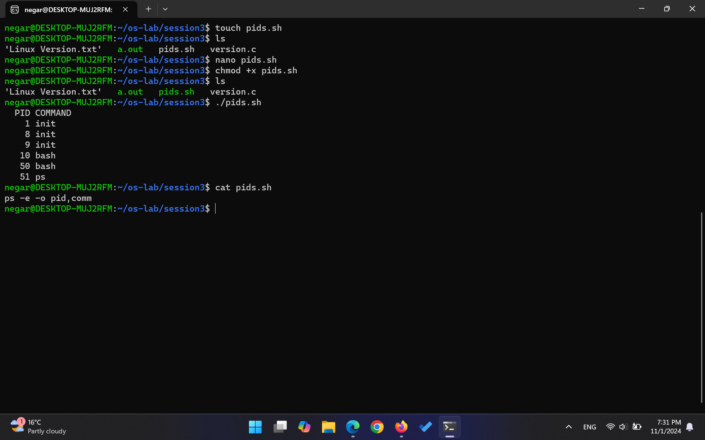

- [x] Place your source code for a program that shows details of a program by receiving PID:
    - [x] 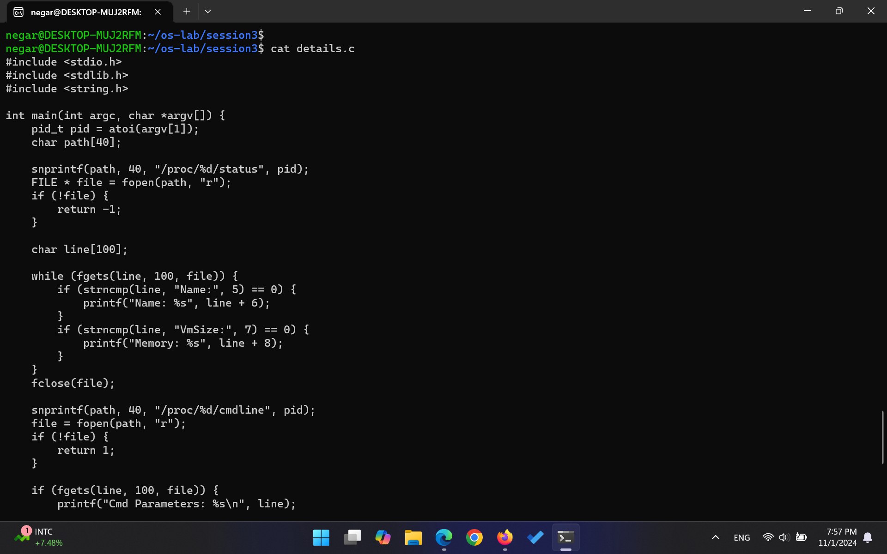
          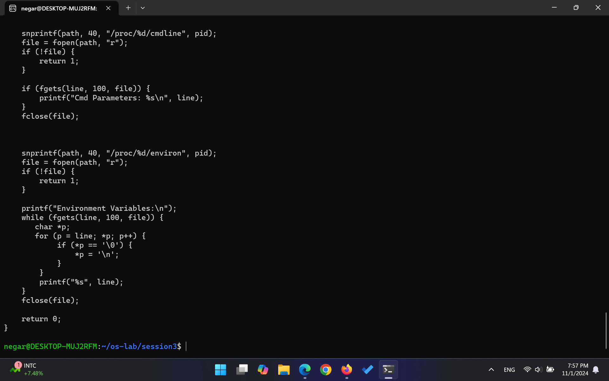
          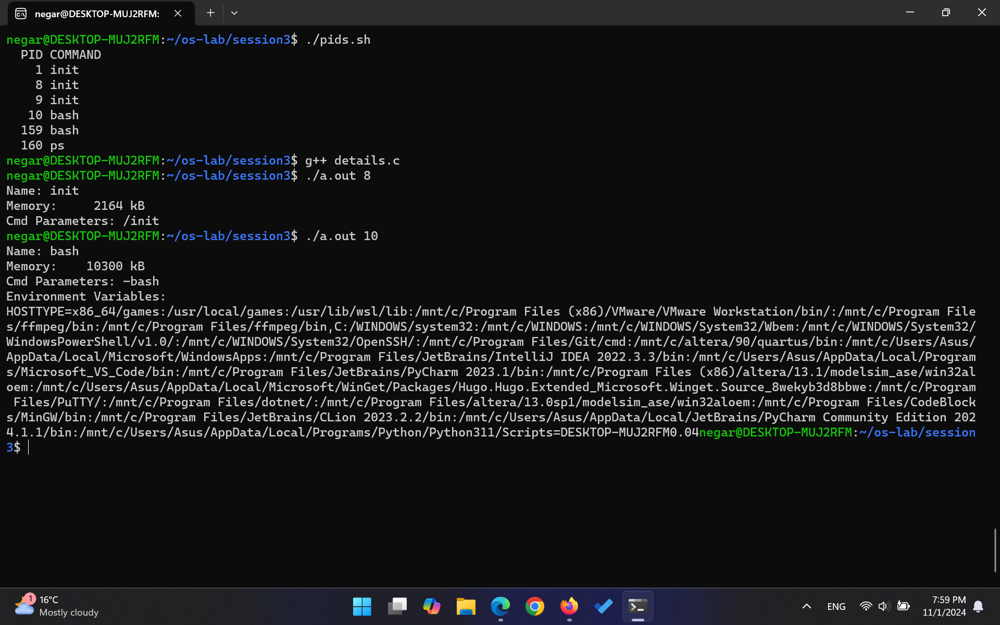

### Section 3.3.4
- [x] Write (in English or Persian) about each file in /proc/ directory:
    1. `فایل meminfo شامل اطلاعاتی درباره‌ی حافظه، مانند حافظه‌ی کل، حافظه‌ی آزاد (free)، کش‌ها و ... است. `
    
    2. `مانند آنچه در بخش اولیه گذاشته شد، فایل version حاوی اطلاعاتی درباره‌ی نسخه‌ی کرنل، ورژن gccای که برای build کردن کرنل استفاده شده است و زمان build است.`
    
    3. `مدت زمانی که سیستم بالا بوده است و همچنین load average در فایل uptime آورده شده است. `
    
    4. `در فایل stat آماری مربوط به cpu آورده شده است. بیان شده است که چقدر زمان مثلا در usermode بوده است، چقدر idle بوده است، چند پردازه در حال اجرا هستند و ... `
    
    5. `فایل mounts در گذشته شامل لیست همه‌ی فایل سیستم‌هایی بود که روی سیستم mount شده‌اند. پس از یک نسخه‌ای به بعد، این فایل لینکی به proc/self/mount شد که mount pointهای namespace پردازه را نشان می‌دهد.`
    
    6. `دایرکتوری net شامل فایل‌هایی با اطلاعات درباره‌ی network و آمارهای مربوط به آن است. مثلا دیوایس‌های شبکه، configurationها، و پروتکل‌های شبکه در کرنل.`
    
    7. `فایل loadavg نشان می‌دهد سیستم چقدر شلوغ است. میانگین لود روی سیستم برای ۱ دقیقه، ۵ دقیقه، و ۱۵ دقیقه‌ی قبل را نشان می‌دهد. میزان cpu utilization را هم با استفاده از نسبت scheduling entities مصرفی به کل نشان می‌دهد. در آخرین فیلد هم pid پرداز‌ه‌ای که اخیرا اجرا شده است را نشان می‌دهد. `
    
    8. `فایل interrupts تعداد interruptهای هر cpu در هر io device از زمان boot تا الان را نشان می‌دهد. `
    
    9. `در فایل ioports لیست پورت‌های io که با دیوایس‌های سخت‌افزاری مختلف استفاده می‌شوند نشان داده شده است.`
    
    10. `فایل filesystems لیست filesystem هایی که کرنل ساپورت می کند را نشان می‌دهد. `
    
    11. `فایل cpuinfo اطلاعاتی درباره‌ی هریک از پردازنده‌ها دارد. شامل مدل، فرکانس، سایز کش، تعداد coreها، فلگ‌ها و ...`
    
    12. `همانند cmdline در بخش قبل، اینجا پارامترهایی که موقع اجرای کرنل به آن پاس داده شده‌اند نمایش داده می‌شود. `

- [x] Place your source code for a program that shows details of processor:
    - [x]  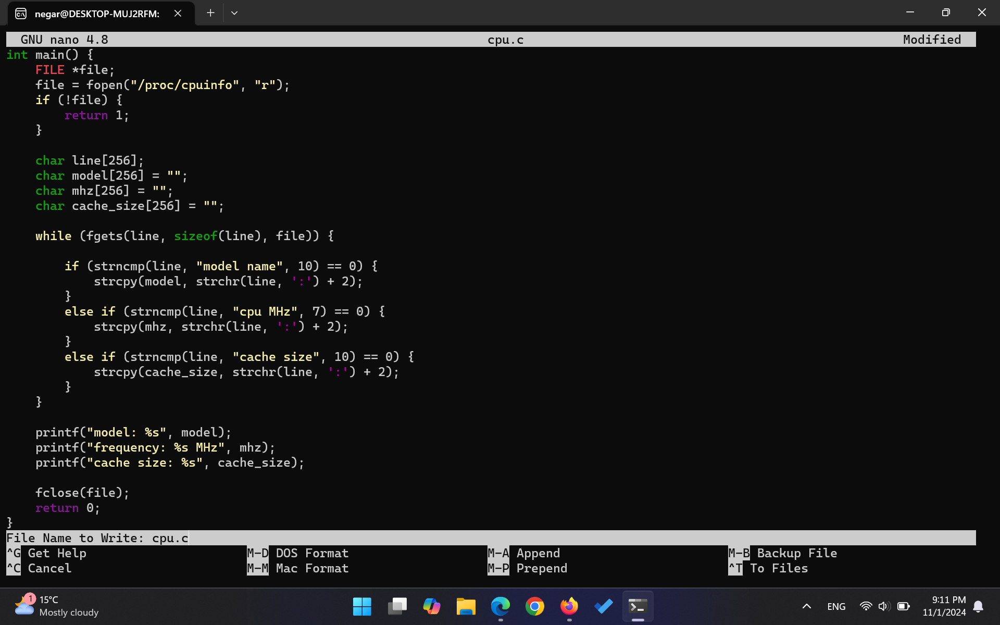
           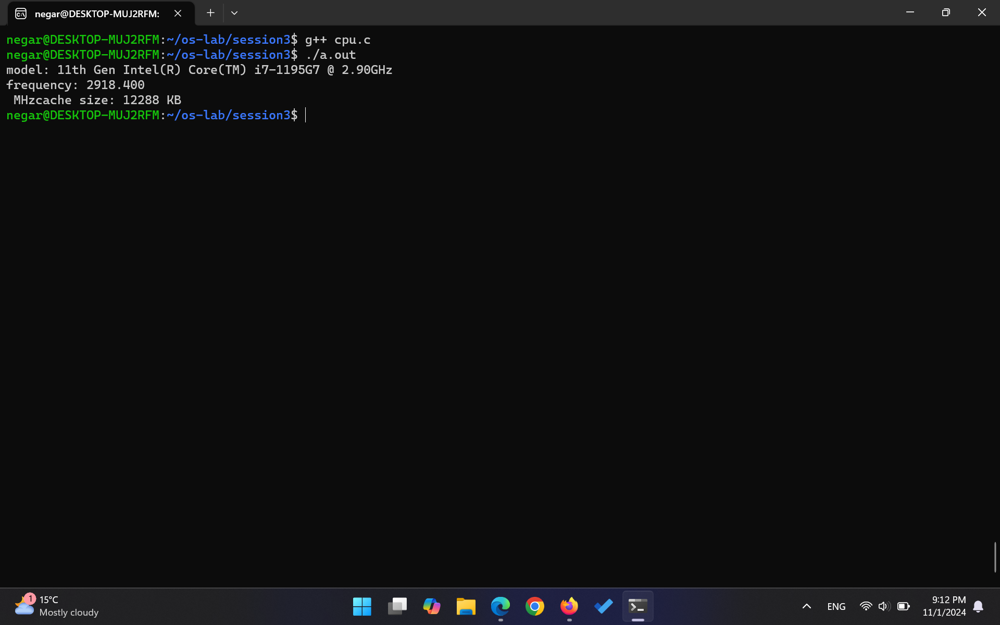

- [x] Place your source code for a program that shows details of memory management sub-system:
    - [x]   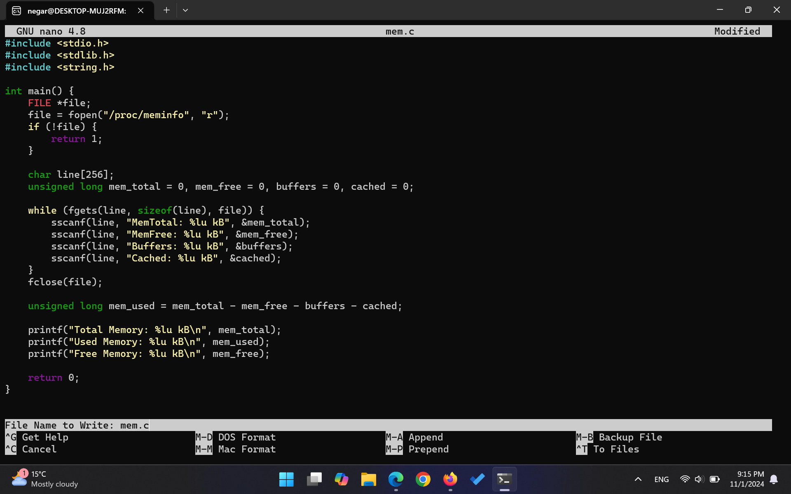
            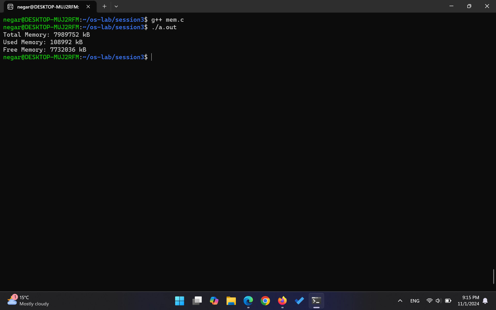

- [x] Write your description about five important files at /proc/sys/kernel:

    - [x] `panic: مدت زمانی که سیستم پس از وقوع یک کرنل پنیک (kernel panic) قبل از rebootصبر می‌کند را تعیین می‌کند. مقدار دیفالت آن 0 است که یعنی به صورت خودکار reboot انجام نمی‌شود.`
    - [x] `hostname: نام میزبان سیستم را ذخیره می‌کند. این نام برای شناسایی سیستم در شبکه استفاده می‌شود. `
    - [x] `osrelease: نسخه‌ی سیستم‌عامل را نشان می‌دهد. شامل اطلاعاتی درباره‌ی نسخه‌ی کرنلی است که در حال اجراست.`
    - [x]  `threads-max:  حداکثر تعداد تردهایی که سیستم می‌تواند ایجاد کند را مشخص می‌کند. `
    - [x] `msgmax: حداکثر اندازه‌ی پیام‌های صف پیام (message queue) را تعیین می‌کند. واحد اندازه‌گیری آن هم بایت است `

- [x] Write your description about /proc/self file
    - [x] `دایرکتوری /proc/self در لینوکس یک symbol link به دایرکتوری پردازه‌ای است که در حال حاضر به این دایرکتوری آمده است. در واقع اگر پردازه‌ی pid=x به این دایرکتوری برود، انگار به دایرکتوری proc/x رفته است. `

## Source Code Submission

please submit all your codes in a zip file

 - [x] [session3.zip](https://github.com/user-attachments/files/17602810/session3.zip)
