# Practice 4: Creating and running processes

Session 4. Official instructions: [session4.md](https://github.com/Sharif-OS-Lab/session-3-4/blob/master/session4.md)

The session covered how processes are created and run: looking at running processes and their PIDs with `ps`, `getpid` and `getppid`, creating children with `fork` and seeing that parent and child have separate memory, waiting for a child with `wait`, watching an orphan get adopted, and finally replacing a process image with the `exec` family.

Sources in this folder, in the order the report uses them: `pid.c`, `parent_pid.c`, `fork.c`, `wait.c`, `kill_parent.c` (the adoption test) and `execvp_usage.c`.

---

Student Name of member 1: `Negar Babashah`

Student Name of member 2: `Iman Mohammadi`

- [x] Read Session Contents.

### Section 4.4.1
- [x] Investigate the ps command
    1. [x] 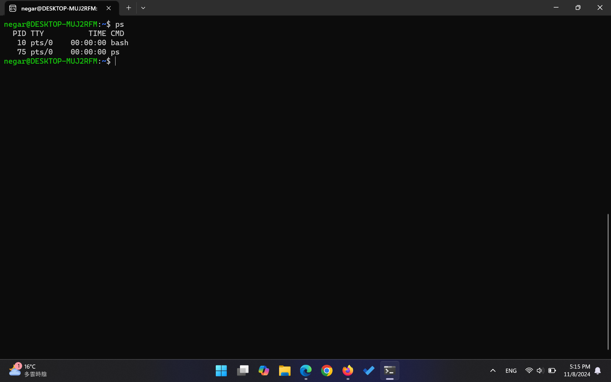

   
- [x] Infromation about processes with PID = 1
    1. [x] می‌توان طبق تصویر زیر دید که پردازه با pid=1 همان init است. 
    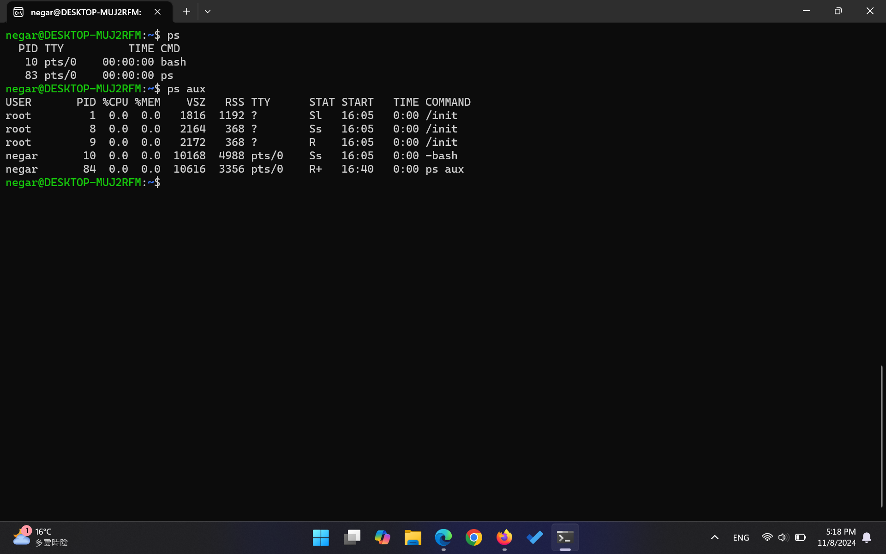

حال با استفاده از `man init` اطلاعات مربوط به آن را پیدا می‌کنیم:
    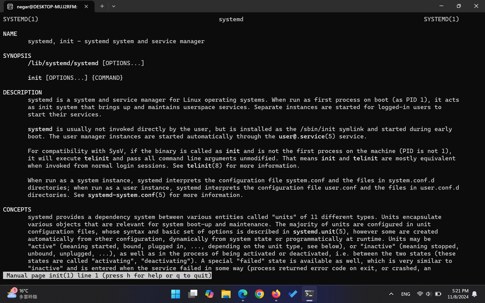

بنابراین این پردازه اولین پردازه‌ای است که در سیستم عامل لود و اجرا می‌شود. وظیفه‌ی اصلی آن مدیریت فرآیندها و سیگنال‌ها در سیستم عامل است. پردازه‌های بعدی از بچه‌های این پردازه به بعد به وجود می‌آیند.

- [x] Program using getpid
    1. [x] 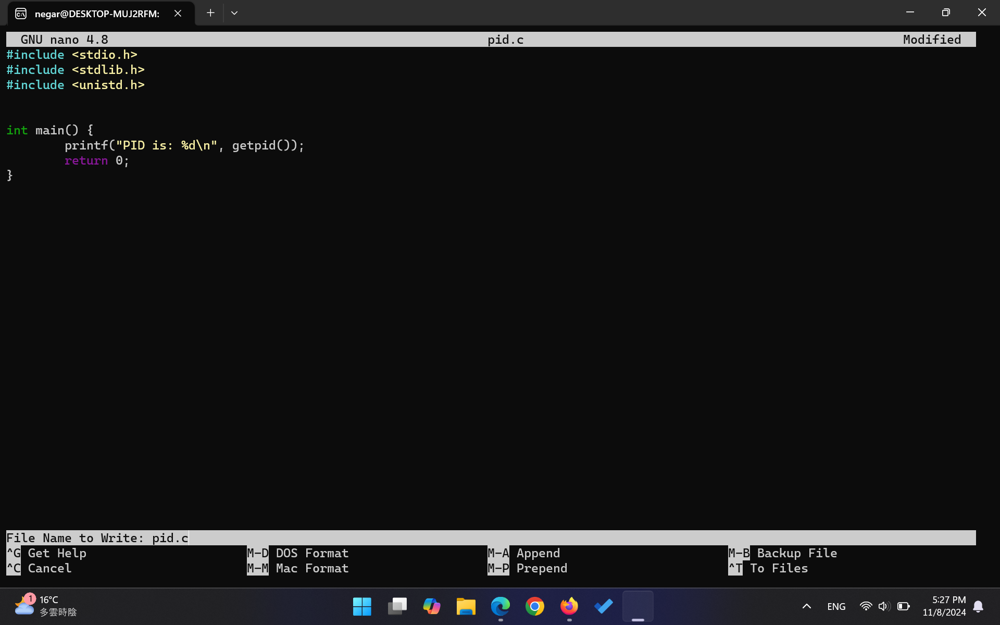
           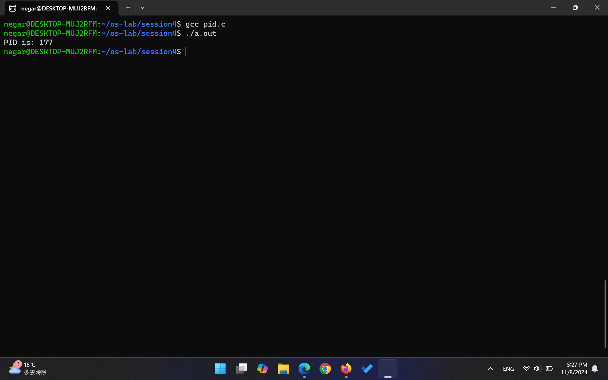

### Section 4.4.2

- [x] Program using getppid
    1. [x] 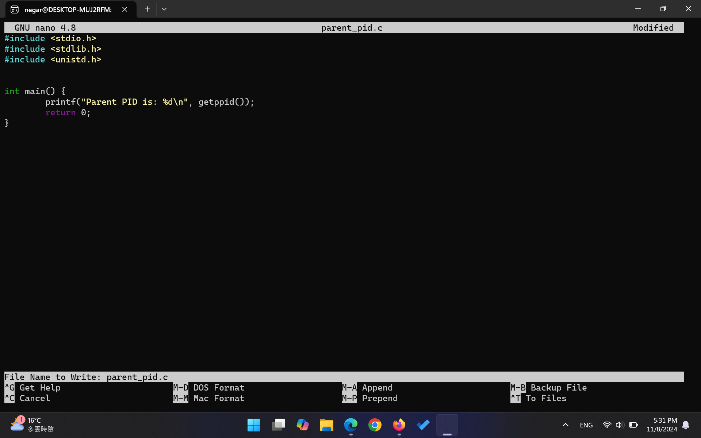
    2. [x] پردازه‌ی پدر این پردازه، همان bash است. چرا که ما آن را از طریق ترمینال اجرا کرده‌ایم. بنابراین bash می‌آید یک فرزندی می‌سازد که درواقع همان کدی است که زده‌ایم. طبق تصویر زیر، bash پردازه‌ای است که دستورها را از طریق ورودی استاندارد یا از طریق یک فایل اجرا می‌کند.     
           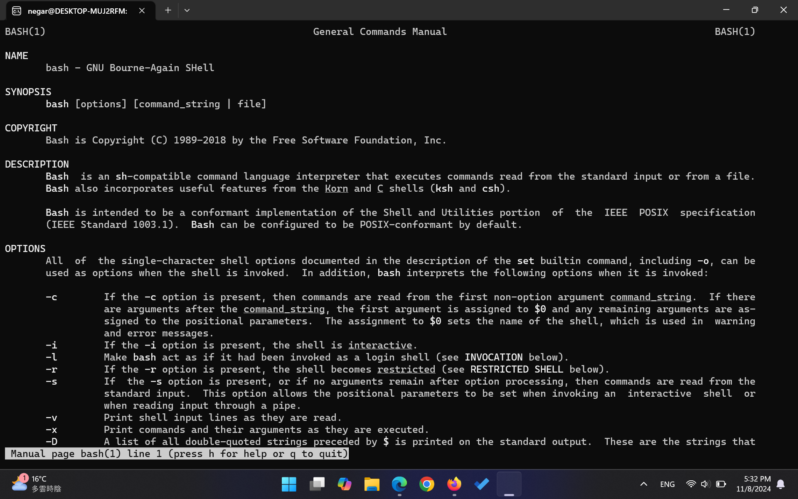

    3. [x] 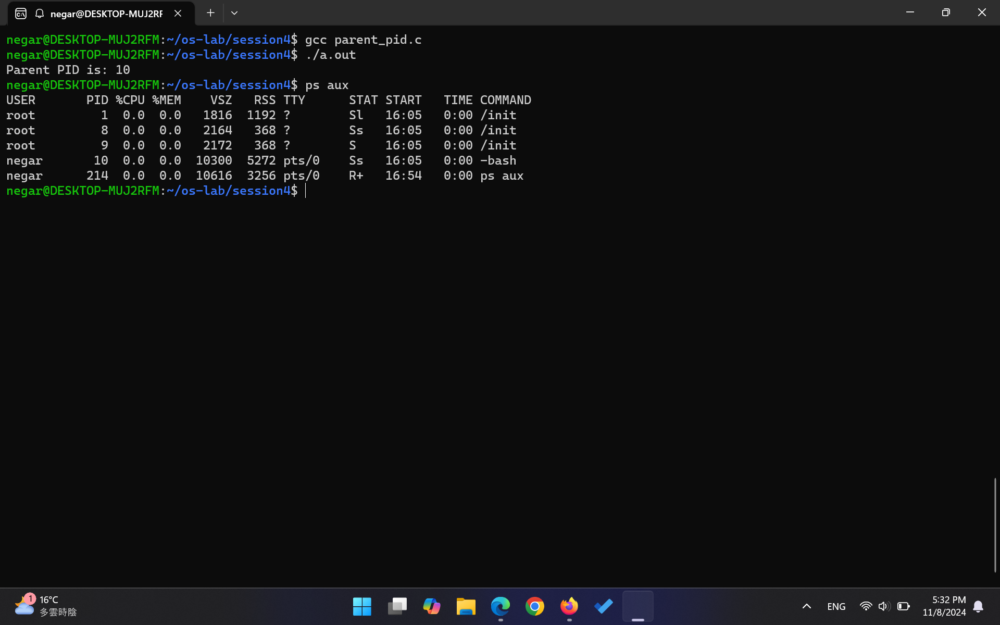

- [x] Describe the C program (fork program)
    1. [x] تابع fork() در خروجی خود به پردازه‌ی فرزند ۰ و به پردازه‌ی والد pid مربوط به فرزند را خروجی می‌دهد. بنابراین فرزند وارد if اول می‌شود ولی والد نمی‌شود. فرزند وقتی اجرا شود مقدار ۲۳ را برمی‌گرداند. والد که به بخش else رفته است، تا زمانی که فرزند اجرایش تمام نشده باشد wait می‌کند و چیزی که فرزند return کرده باشد را در rc می‌ریزد. که همان طور که نمایش داده شده است، ۲۳ است.

           

- [x] Program showing that memory of the parent and the child is seperate
    1. [x] 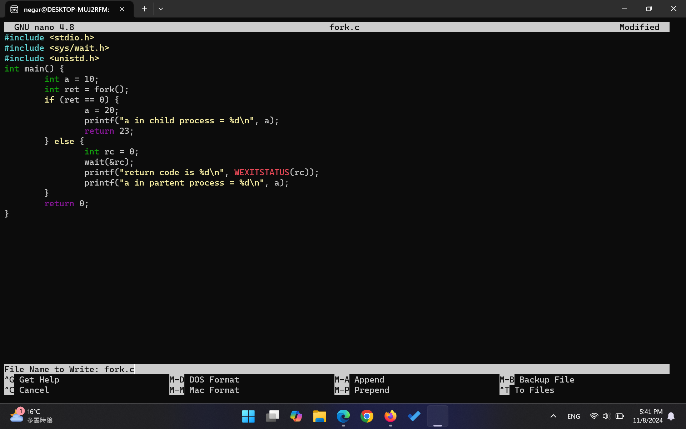
           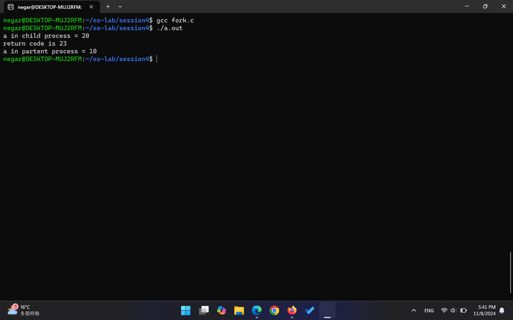

توضیح: همان طور که مشاهده می‌شود، مقدار a در ابتدا ۱۰ بود. این مقدار در حافظه‌ی فرزند هم کپی می‌شود (برای آن تعریف شده است). ولی فرزند می‌تواند آن را تغییر دهد، بدون این که مقدار مورد نظر برای والد تغییر کند.

- [x] Program printing different messages for parent and child process
    1. [x] 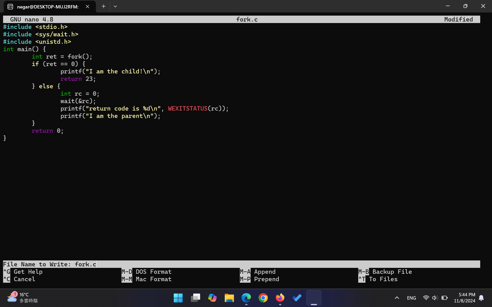
           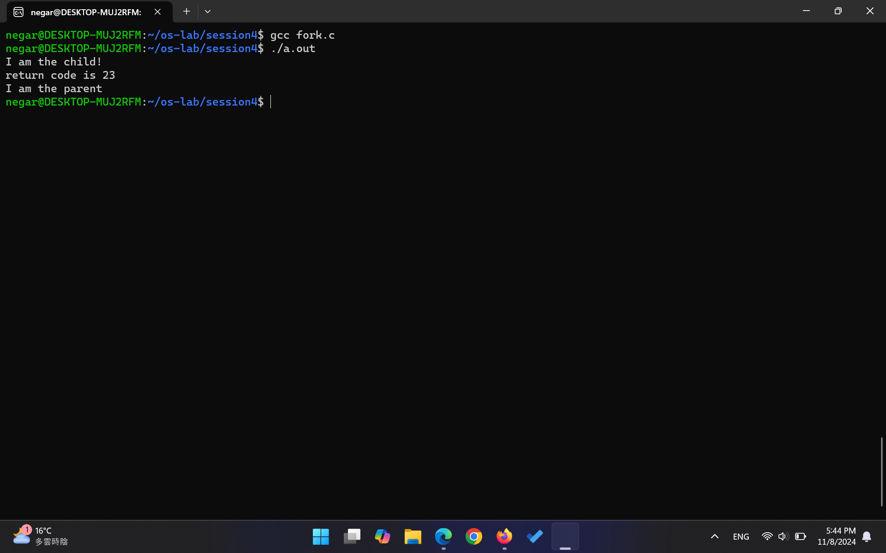

- [x] Program for the last task of this section
    1. [x] 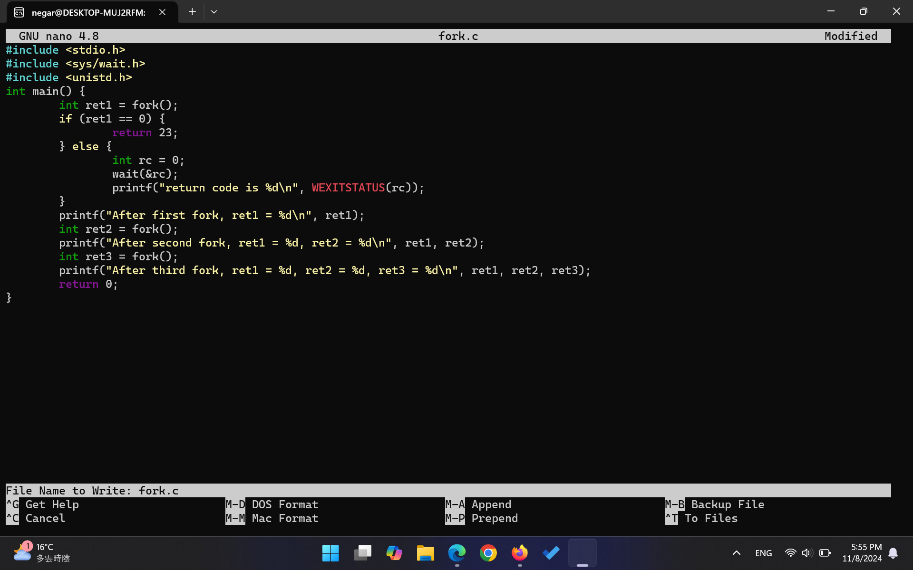

    2. [x] 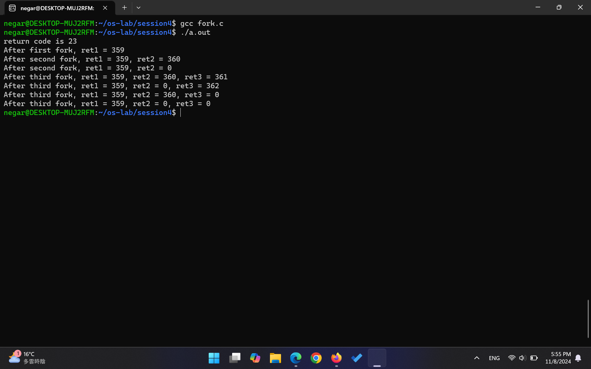

همان طور که مشخص است، ۳ بار از fork استفاده شده است. هر fork متناظر با خودش، یک پردازه‌ی فرزند دیگر نیز اضافه می‌کند که می‌تواند fork های بعدی را هم اجرا کند. توجه کنید که اولین پردازه‌ی child وارد if کد بخش ۲ می‌شود و return 23 می‌کند. یعنی دیگر این پردازه forkهای بعدی را اجرا نمی‌کند. بنابراین پردازه‌های بعدی را parent این پردازه ساخته است. پس مقدار ret1 (خروجی اولین fork) برای سایر پردازه‌ها برابر با pid این پردازه (در اینجا ۳۵۹) است. پس از آن، دوباره یک fork اجرا می‌شود. مقدار ret2 برای پردازه‌ی پدرش برابر با pidاش بوده (در اینجا ۳۶۰) و برای پردازه‌ی جدید، ۰ است. حال هر دوی این پردازه‌ها،  به سراغ fork بعدی می‌روند و هر یک یک child جدید نیز ایجاد می‌کنند. بنابراین در نهایت ۴ پردازه خط آخر را اجرا می‌کنند که با استدلال مشابه قبل، ترکیب‌های مختلفی از مقدارهای ممکن برای ret2 , ret3 را می‌گیرند (۴ ترکیب در مجموع).

## Section 4.4.3

- [x] Program using `wait` and counting from 1 to 100
    1. [x] 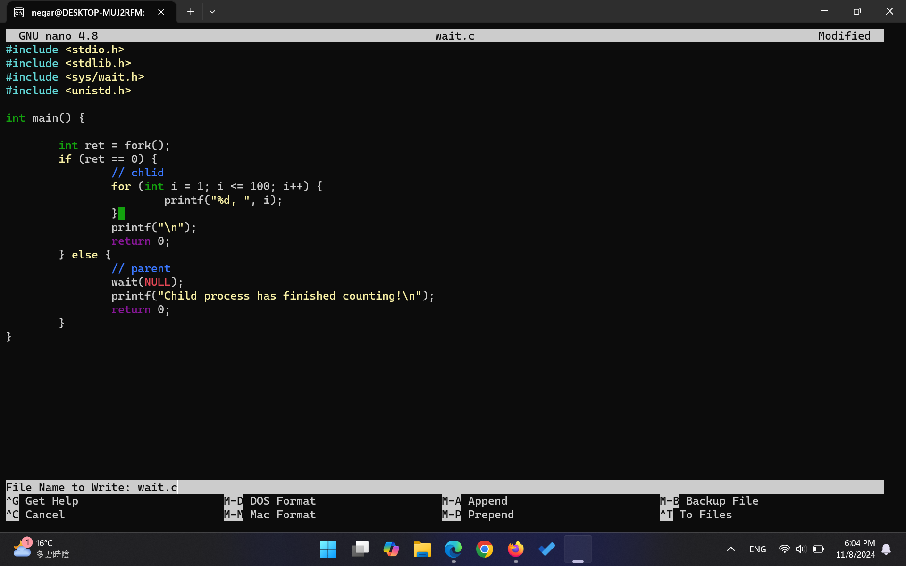
    همان طور که مشخص است، پردازه‌ی پدر آنقدر منتظر می‌ماند تا پردازه‌ی فرزند کارش را انجام بدهد، و سپس از wait خارج می‌شود.
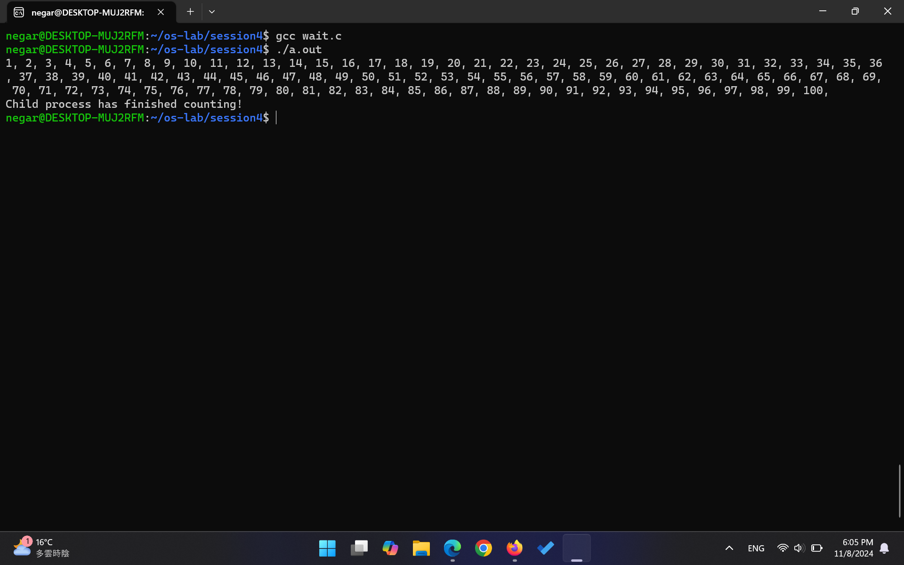

    1. [x] پارامتر اول تابع `wait`، از جنس int* به نام wstatus است. اگر این پوینتر null قرار داده نشود، اطلاعاتی از پردازه‌ای که برای آن wait کرده‌ایم (پردازه فرزند) در آن قرار داده می‌شود و مانند بخش ۴.۴.۲ گزارش کار، می‌توان با فراخوانی توابعی مانند WEXITSTATUS، اطلاعات مربوط به پردازه (مثلا این که با چه سیگنال یا کدی خارج شده است یا ...) را مشاهده کرد.

- [x] Program showing process adoption
    1. [x] 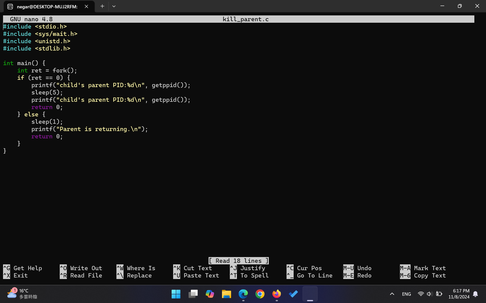
    1. [x] 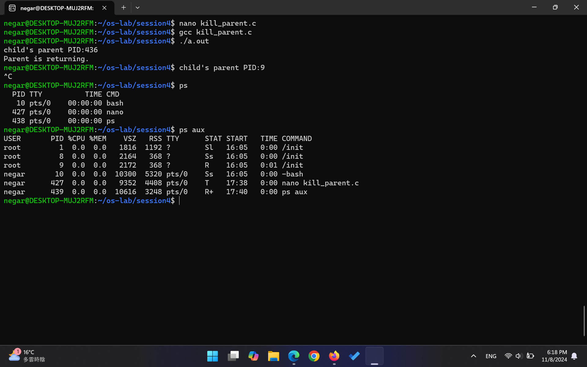
همان طور که مشاهده می‌شود، پردازه‌ی parent به پایان می‌رسد اما پس از آن همچنان child ادامه دارد و parent آن پردازه با pid=9 می‌شود. در خروجی ps aux مشاهده می‌شود که این پردازه همان init است.

### Section 4.4.4

- [x] Describe following commands/APIs:
    1. `execv`: این دستور برای اجرای یک فایل executable با استفاده از لیستی از آرگومان‌ها به کار می‌رود که  آرگومان‌ها به صورت لیست به تابع پاس داده می‌شوند. آرگومان اول مسیر اجرایی فایل و آرگومان دوم خود آن لیست است؛ عنصر اول لیست اسم خود برنامه و عنصرهای بعدی آرگومان‌هایی هستند که باید به برنامه پاس داده شوند. در انتهای لیست هم NULL را می‌دهیم تا نشان دهیم آرگومان‌ها تمام شده‌اند. اگر اجرای این تابع موفقیت‌آمیز باشد، هیچ‌گاه به خط بعدی کد باز نمی‌گردد. در صورت بروز خطا، مقدار -1 برگردانده می‌شود و متغیر errno تنظیم می‌شود تا نوع خطا را مشخص کند.

    1. `execl`: این دستور مشابه دستور execv برای اجرای یک فایل executable با استفاده از لیستی از آرگومان‌ها به کار می‌رود که به صورت جداگانه به تابع پاس داده می‌شوند. آرگومان اول مسیر اجرایی فایل، آرگومان دوم اسم خود برنامه، و آرگومان سوم به بعد، آرگومان‌هایی هستند که باید به برنامه پاس داده شوند.

    1. `execvp`: این دستور مشابه با دستور execv است، اما فایل اجرایی را در مسیرهای مشخص شده در متغیر محیطی PATH جست‌و‌جو می‌کند. در واقع نیاز به مشخص کردن کامل آدرس فایل اجرایی نیست، به شرطی که در PATH تعریف شده باشد.

    1. `execlp`: این دستور هم مشابه با دستور execl است، اما فایل اجرایی را در مسیرهای مشخص شده در متغیر محیطی PATH جست‌و‌جو می‌کند. در واقع نیاز به مشخص کردن کامل آدرس فایل اجرایی نیست، به شرطی که در PATH تعریف شده باشد.

- [x] Program which forks and executues `ls` command
    1. [x] 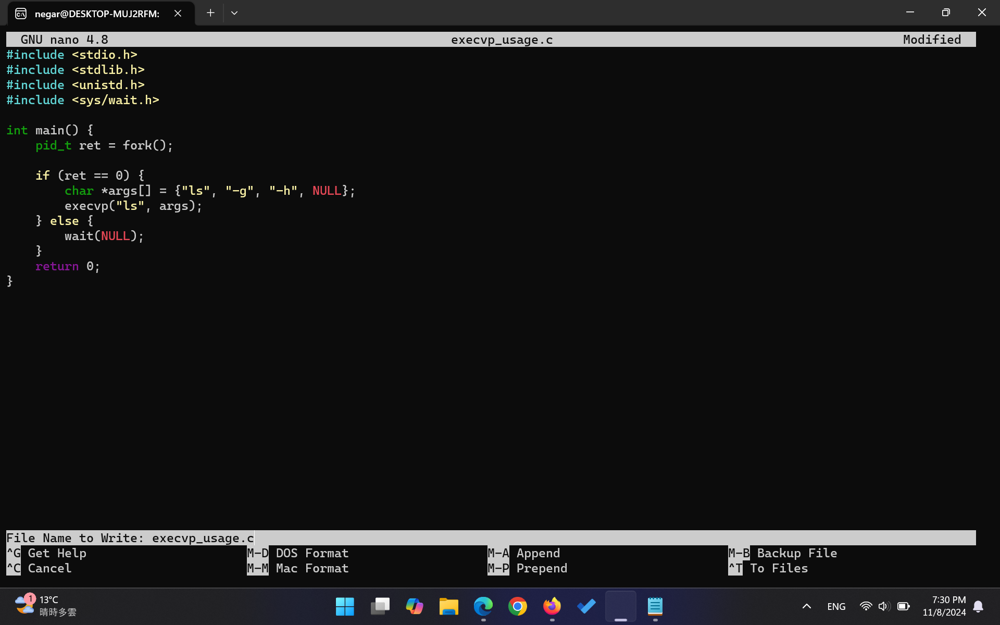

    1. [x] 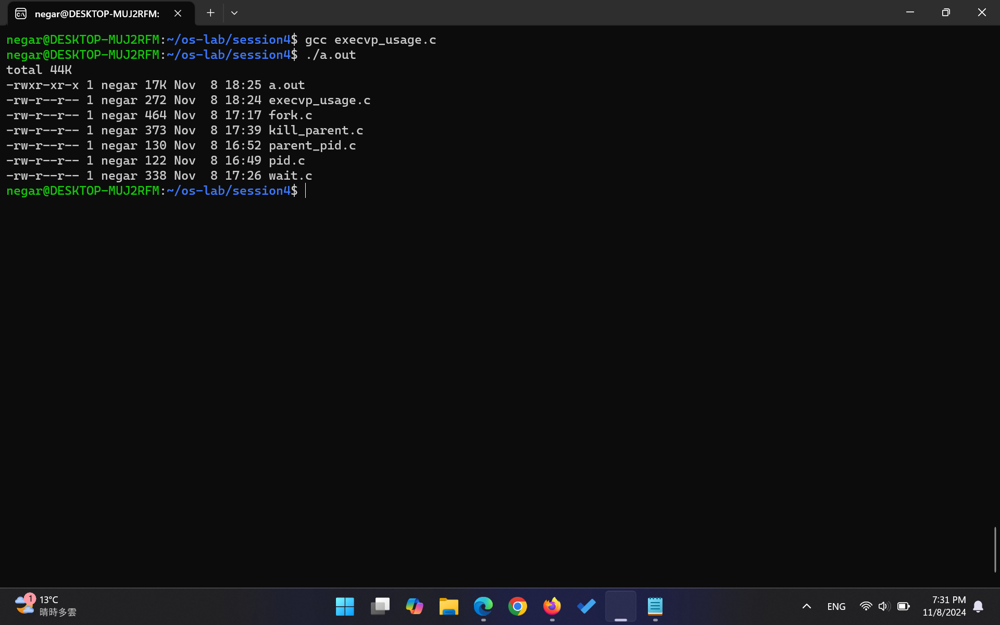

## Source Code Submission

please submit all your codes in a zip file

 - [x] The zip I attached to the original report is no longer reachable. It held the
   same sources that are in this folder: `pid.c`, `parent_pid.c`, `fork.c`, `wait.c`,
   `kill_parent.c` and `execvp_usage.c`.
