# Practice 5: Pipes and signals

Session 5. Official instructions: [session5.md](https://github.com/Sharif-OS-Lab/session-5-6/blob/main/session5.md)

The session had two halves. The first was inter-process communication over a one-way pipe: passing a string from one process to another, then wiring `ls` into `wc` the way a shell does, and working out what a bi-directional pipe would need. The second was signals: describing the common ones, handling `SIGALRM` with `sigaction` and `pause` so the program continues instead of being killed by the alarm, and writing a program that only exits the second time Ctrl+C is pressed.

We answered this session with screenshots of the code and its output, so there are no `.c` files in this folder.

---

Student Name of member 1: `Iman Mohammadi`

Student Name of member 2: `Negar Babashah`

  - [x] Read Session Contents.

    1. [x] 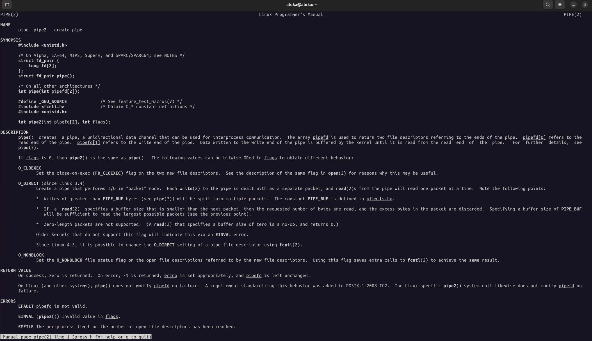
    2. [x] 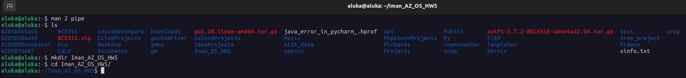
    3. [x] 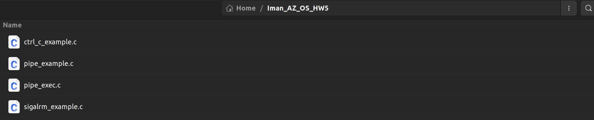

### Section 5.3.1

- [x] Write the `Hello World!` program

    4. 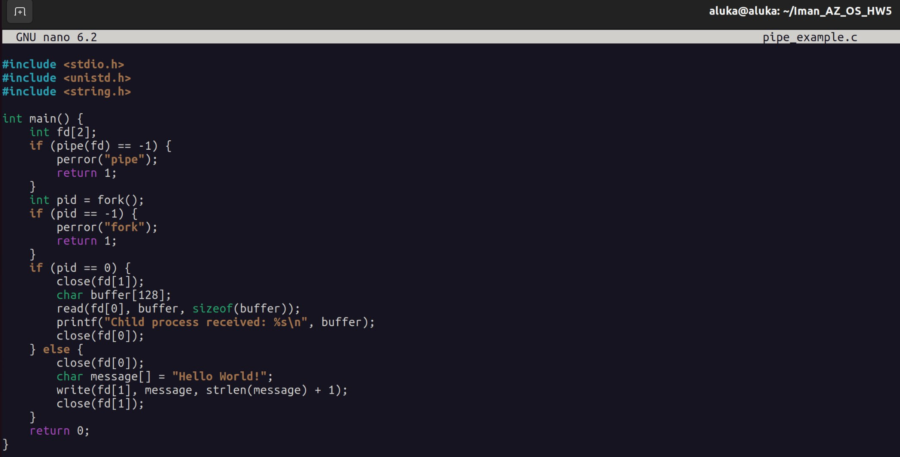
    5. 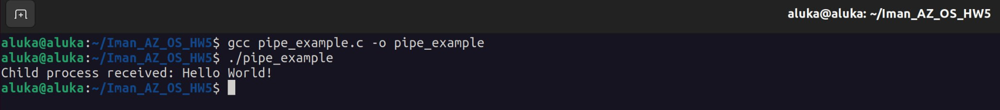

- [x] Write the `ls` to `wc` program

    6. 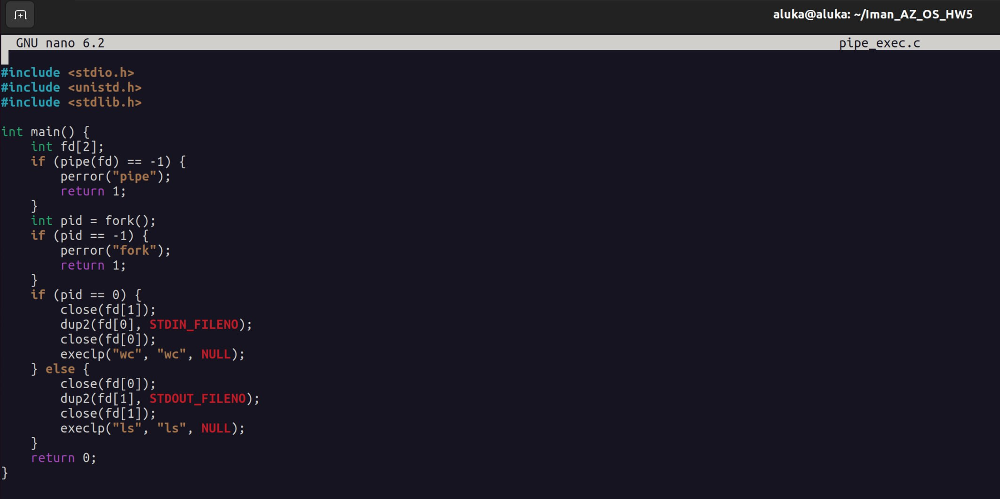
    7. 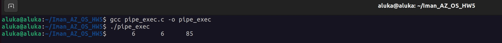

- [x] Investigate how to have a bi-direction pipe

    8. `Two separate pipes must be created to achieve bi-directional communication between two processes. Each pipe allows one-way communication. One pipe can be used for the parent to send data to the child, while the other pipe is used for the child to send data back to the parent. After creating the pipes, proper closing of unused read/write ends in both processes is crucial to avoid deadlocks.`

### Section 5.3.2

- [x] Describe the usecase of different signals:

    9. `SIGINT: This signal is sent when the user presses Ctrl + C. It is used to interrupt and terminate a running process.`
    10. `SIGHUP: This signal is sent when the terminal or controlling process is disconnected. It is often used to restart or reload configuration files in daemons.`
    11. `SIGSTOP: This signal stops (pauses) a process. It is sent by the system or via commands like kill -STOP. This signal cannot be caught or ignored.`
    12. `SIGCONT: This signal resumes the execution of a stopped process. It is used in conjunction with SIGSTOP to control process execution.`
    13. `SIGKILL: This signal forcibly terminates a process. It cannot be caught or ignored, ensuring the process is stopped immediately.`

- [x] Describe SIGALRM

    14. `The SIGALRM signal is sent to a process after the timer set by the alarm() system call expires. It is often used for timeouts or periodic tasks.`

- [x] Investigate the given code

    15. `This code sets an alarm to send SIGALRM after 5 seconds. The program enters an infinite loop and will terminate when the signal is received. The signal handler is not implemented, so the default action is to terminate the process.`
    16. 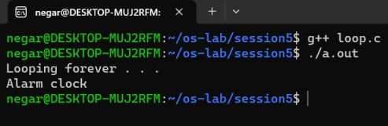

- [x] Modify the given program by handling SIGALRM

    17. 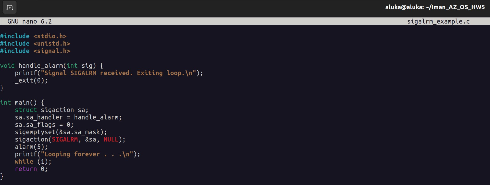
    18. 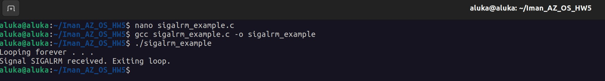

- [x] Write a program that handles Ctrl + C

    19. 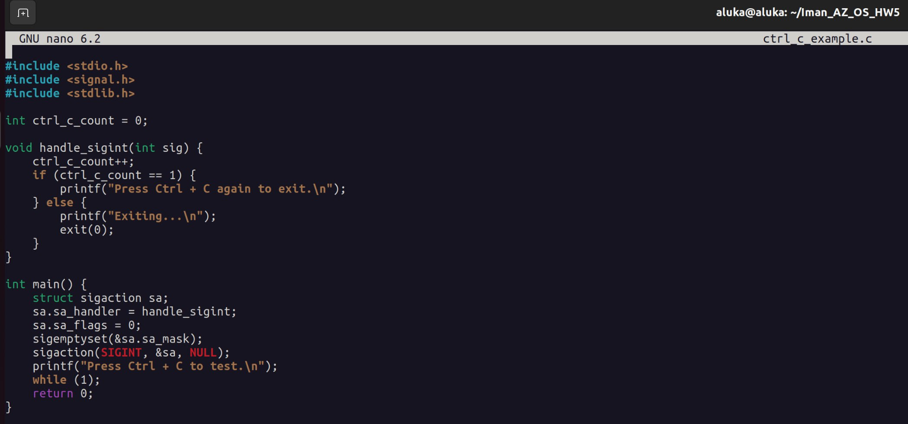
    20. 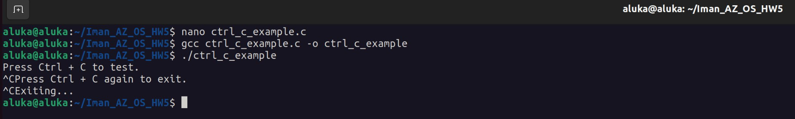
