# Practice 6: Memory management

Session 6. Official instructions: [session6.md](https://github.com/Sharif-OS-Lab/session-5-6/blob/main/session6.md)

The session walked through how a process uses memory: allocating and freeing with `malloc` and `free`, reading a process's memory columns out of `ps`, looking at the text/data/bss segments with `size`, seeing shared libraries with `ldd`, and then the linker symbols `etext`, `edata` and `end`, the top of the heap via `sbrk(0)`, and the direction the stack grows.

Sources in this folder: `alloc.c` (malloc and free), `symbols.c` (the linker symbols), `heap.c` (the `sbrk` loop) and `stack.c` (the recursive stack-growth test).

---

Student Name of member 1: `Negar Babashah`

Student Name of member 2: `Iman Mohammadi`

- [x] Read Session Contents.

## Section 6.4

- [x] Using `malloc` and `free` in program
    - [x] Source: `alloc.c` in this folder. The screenshot below is the compile and run;
      I built it with `g++`, which is why the cast in it is written C++ style.
    - [x] 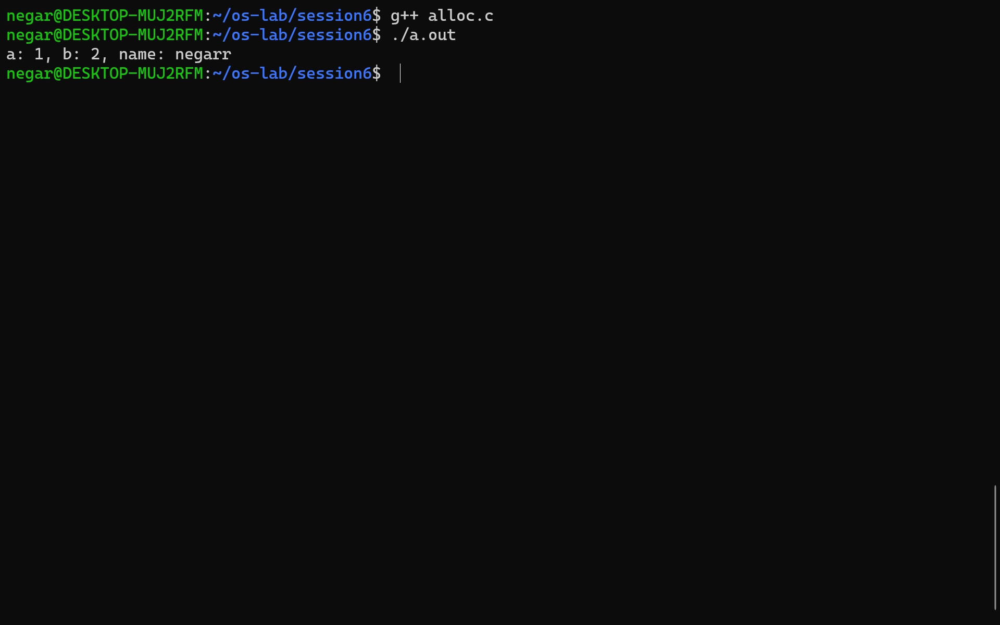

    
- [x]  Using `ps`
    - [x] 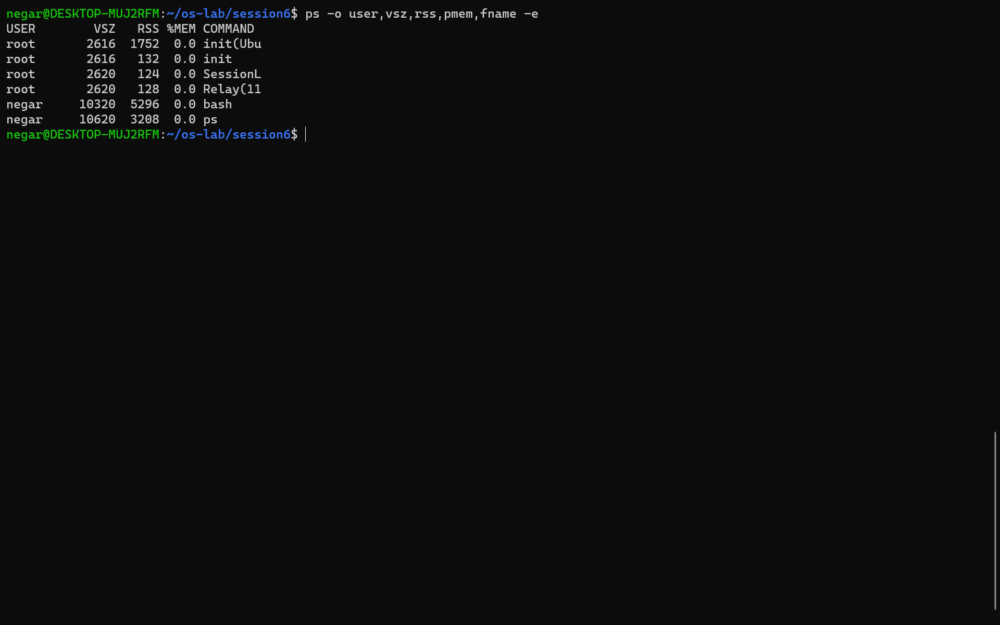
    - [x] USER: یوزرنیم کاربری که مالک پردازه است
    
VSZ: مقدار حافظه مجازی‌ به کیلوبایت که توسط پردازه استفاده میشود

RSS: مقدار حافظه‌ی فیزیکالی که پردازه اکنون در رم اشغال کرده است.

PMEM: درصدی از حافظه فیزیکال کل که پردازه مشغول کرده است

COMMAND: در واقع دستور یا فایل اجرایی که پردازه را اجرا کرده است

- [x]  Getting started with memory segments
    - [x] 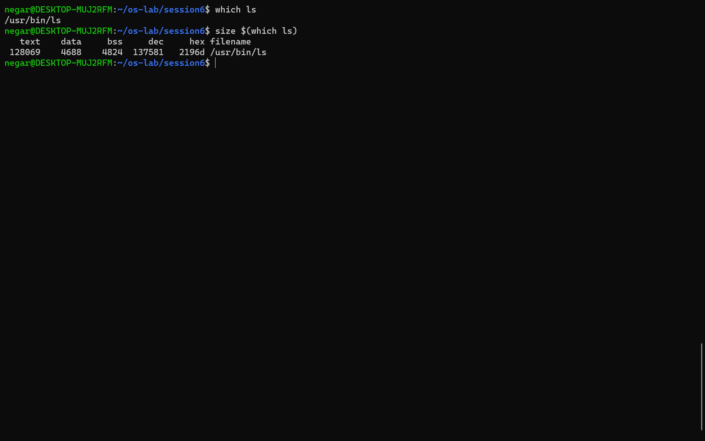
    - [x] 
    - [x]  دستور size اطلاعاتی درباره‌ی بخش heap و stack ارائه نمی‌دهد. چون این دو بخش در زمان اجرای پردازه مشخص می‌شوند و در زمان کامپایل اطلاعاتی درباره‌ی آن‌ها نداریم. 

- [x] Getting started with memory sharing
    1. [x] 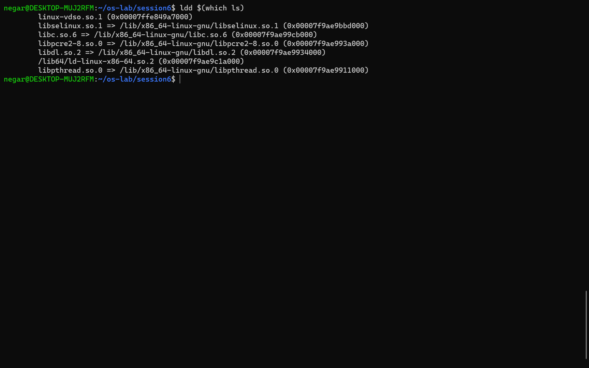
    1. [x] 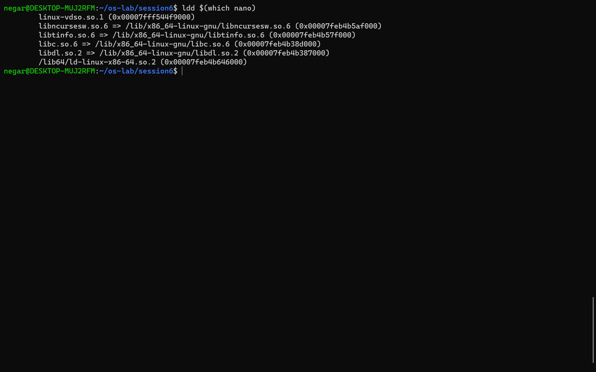
    1. [x] 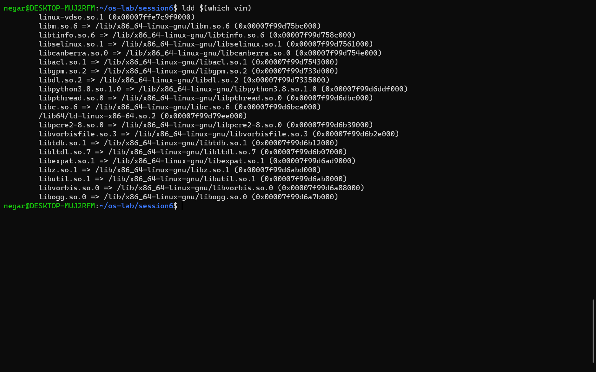
    2. [x] 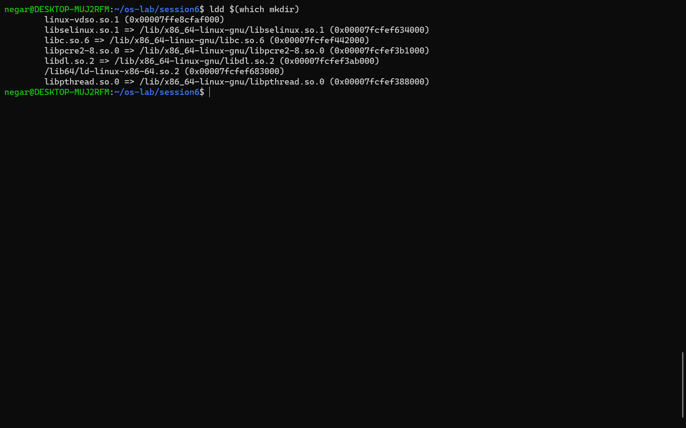

- [x] Getting started with addresses

    1. [x] 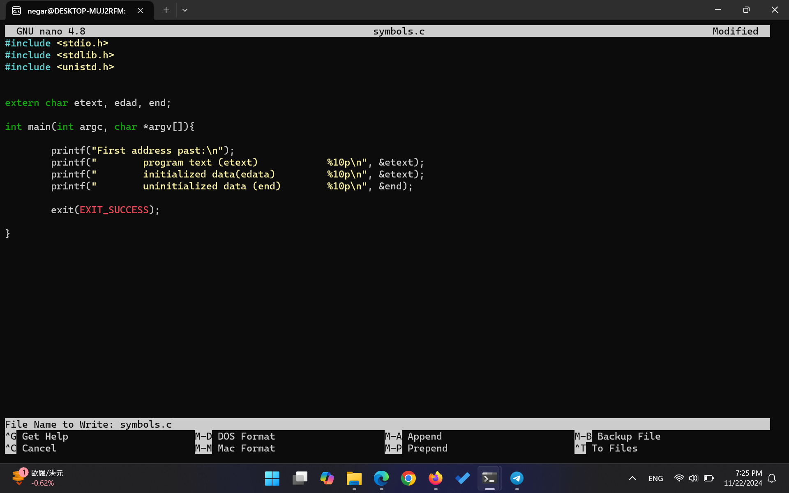
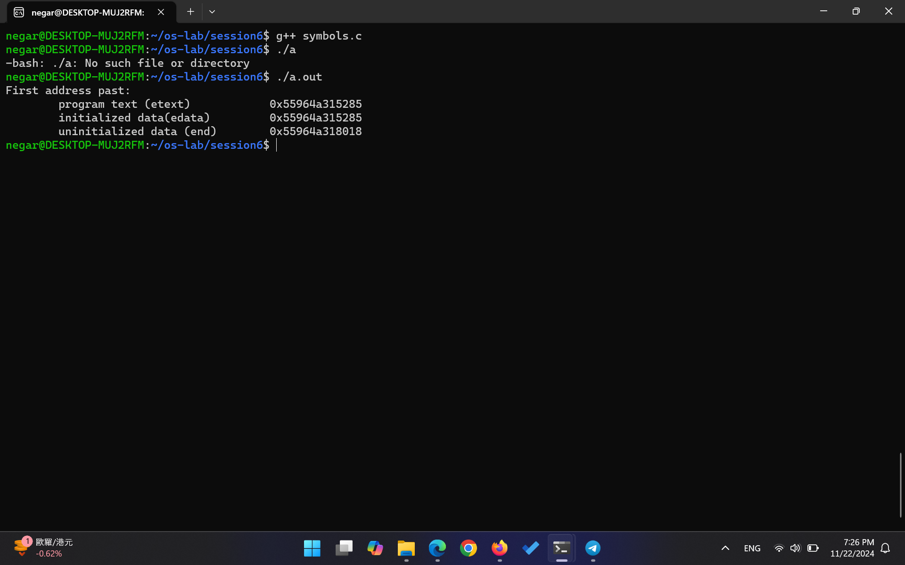
همان طور که مشخص است، ترتیب قرار گیری آدرس‌ها از پایین به بالا text, initialized , uninitialized است که با قرارگیری در تصویر هم‌خوانی دارد.

نکته‌ای که موقع مرتب کردن این گزارش متوجه شدم: در `symbols.c` نماد دوم را `edad` تایپ کرده‌ام و در خطِ مربوط به initialized data هم دوباره `&etext` را چاپ کرده‌ام. پس دو خط اول خروجی یک آدرس یکسان را نشان می‌دهند و آدرس `edata` در عمل چاپ نشده است. کد را همان طور که تحویل داده‌ام نگه داشته‌ام.

    1. [x] درباره‌ی کامنت: همان طور که در لینک گفته شده است،‌ این نمادها توسط لینکر آدرس‌دهی می‌شوند. اما ansi c می‌‌خواهد که کاربر اگر خواست بتواند متغیری مثل etext برای خودش تعریف کند. بنابراین اگر میخواهیم آن‌ها را به عنوان نماد استفاده کنیم بهتر است از روش‌هایی مثل provide استفاده کنیم. حال اگر این کار را نکنیم، باید از یک تایپ مثل char برای تعریف آن‌ها استفاده کنیم، وگرنه کامپایلر warning می‌دهد. درواقع اگر با فلگ `-Wall` بیاییم gcc را اجرا کنیم این هشدارها هم نمایش داده می‌شوند و به مشکل می‌خوریم. بنابراین چیزی که کامنت می‌خواهد بگوید هم همین است.

متغیر یا نماد: تعریف متغیر مکان‌های ذخیره‌سازی است که مقادیر را نگه می‌دارند و تایپ خاصی دارند (مانند int). اما etext، edata و end نشان‌دهنده‌ی آدرس‌های خاصی هستند که توسط لینکر (یا توسط برنامه‌ای) تعریف شده‌اند، نه متغیرهایی که مقدار داشته باشند.

درباره‌ی extern:    از آن در زبان C برای اعلام یک متغیر یا تابع استفاده می‌شود که در یک فایل دیگر تعریف شده است. بنابراین باید به کامپایلر اطلاع بدهیم که این نمادها وجود دارند اما در فایل فعلی تعریف نشده‌اند. 
    
    1. [x] 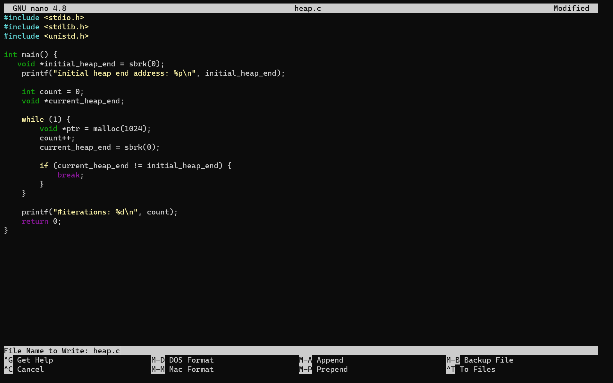
    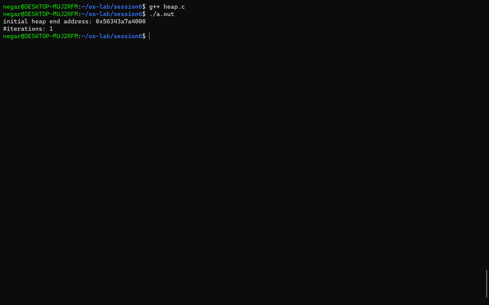

با وجود این که در سیستم من تعداد حلقه‌ها همان طور که انتظار می‌رفت ۱ بود، ولی ممکن است در سیستمی با توجه به مکانیزمی که برای malloc استفاده می‌شود، این اتفاق نیفتد. مثلا malloc یک pool داشته باشد و از روی آن حافظه‌های خالی را تخصیص دهد. در آن صورت تا زمانی که pool پر نشده است، آدرس خانه آخر هیپ تغییری نمی‌کند.

نکته: در `heap.c` مقدار اولیه‌ی `sbrk(0)` را پیش از اولین `printf` گرفته‌ام. خود آن `printf` برای بافر stdio یک `malloc` انجام می‌دهد و همان، program break را جابه‌جا می‌کند. برای همین حلقه همیشه در تکرار اول تمام می‌شود و عدد ۱ که گزارش کرده‌ام نتیجه‌ی این ترتیب است. صورت آزمایش هم می‌گوید انتظار می‌رود این عدد ۱ نباشد و دلیلش را توضیح دهیم. کد را دست نزده‌ام.

    1. [x] 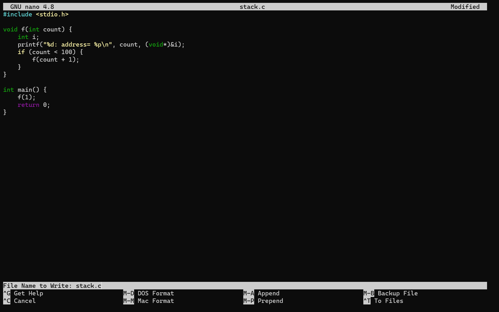
    
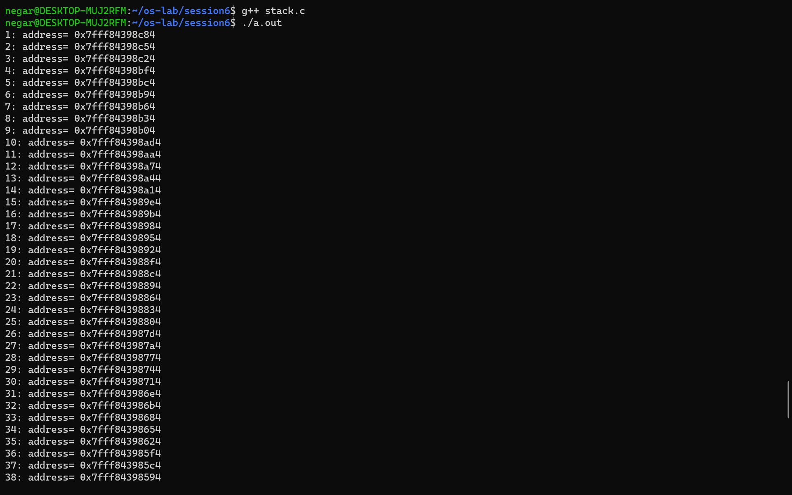
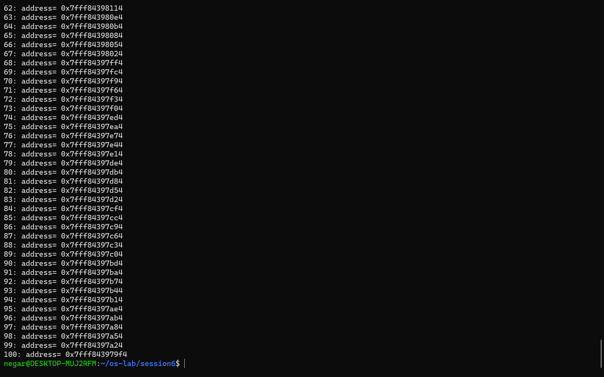
همان طور که مشاهده می‌شود آدرس متغیر i در هر گام کمتر می‌شود. 
این به این دلیل است که استک از بالا به پایین رشد می‌کند. بنابراین وقتی یک فریم جدید به استک اضافه می‌شود، آدرس‌های متغیرهای تعریف شده در آن هم کمتر خواهند بود.

