Team Name: `99109325_99102207`

Student Name of member 1: `Negar Babashah`
Student No. of member 1: `99109325`

Student Name of member 2: `Iman Mohammadi`
Student No. of member 2: `99102207`

- [ ] Read Session Contents.

## Section 7.4

### Section 7.4.1
- [ ] Creating a thread using pthread
    - [ ] 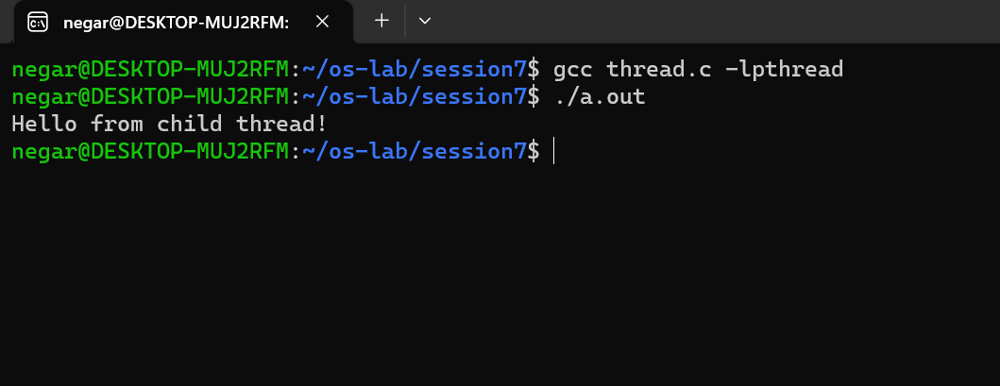

   
- [ ]  Checking the process ids
    - [ ] 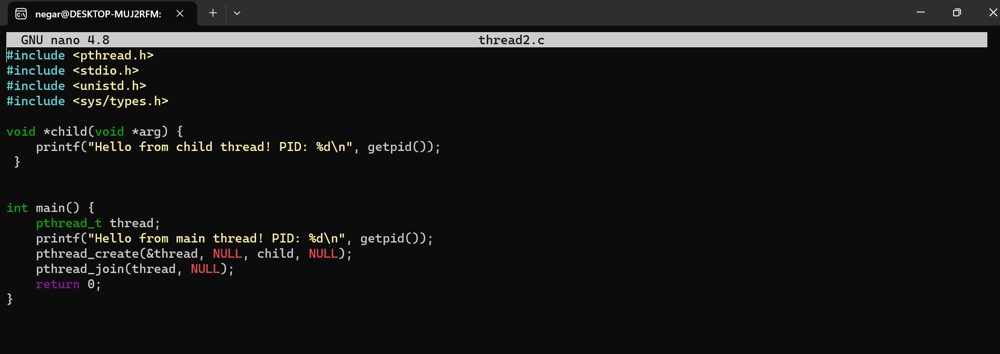

    - [ ] 

    - [ ] همان طور که مشاهده می‌شود pidها یکسان هستند. دلیلش هم این است که دو ترد ایجاد شده هر دو متعلق به یک پراسس هستند.

- [ ]  Shared variables
    - [ ] 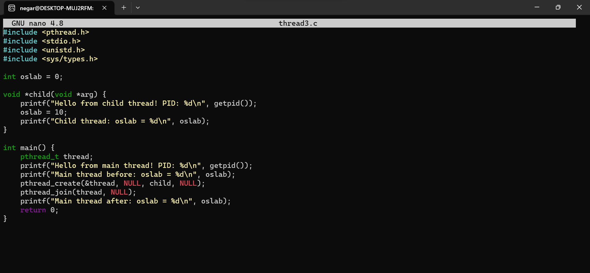

    - [ ] 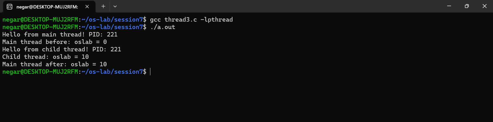

    - [ ]  همان طور که دیده می‌شود مقدارهای oslab در هر دو ترد یکسان است. بنابراین متغیرهای گلوبال در همه‌ی تردهای یک پردازه یکسان هستند و کپی جداگانه‌ای گرفته نمی‌شود.

- [ ] Sum of 2 to n
    1. [ ] 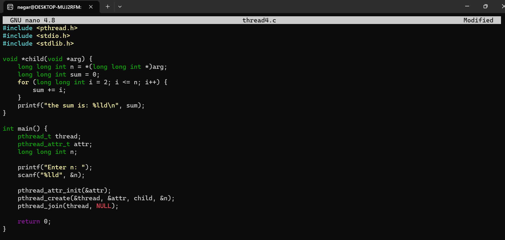

    1. [ ] 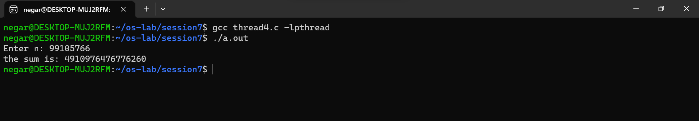

### Section 7.4.2
- [ ] Multiple threads    
    - [ ] 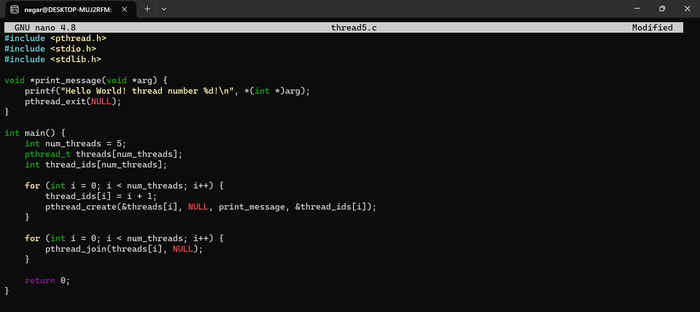

    - [ ] 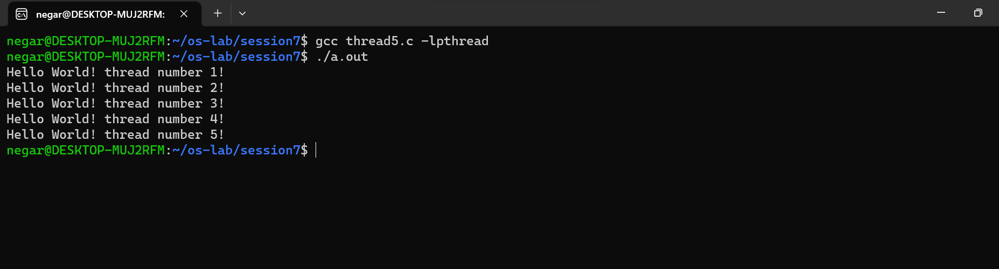

### Section 7.4.3
- [ ] Compiling the code
    - [ ] 

- [ ] global_param
    - [ ] 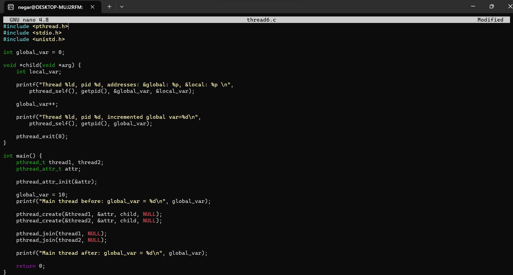

    - [ ] 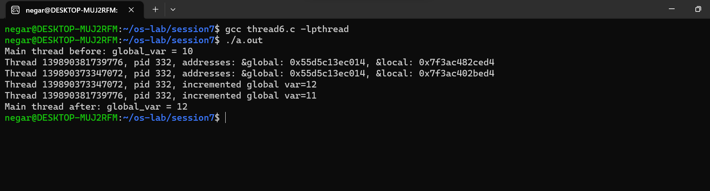

- مشاهده می‌شود که مقدار متغیر گلوبال دو واحد تغییر کرده است. یعنی هر دو ترد آن را افزایش داده‌اند. بنابراین یعنی تردها به متغیرهای گلوبال یکسانی دسترسی دارند.

- [ ] Forking
    - [ ] 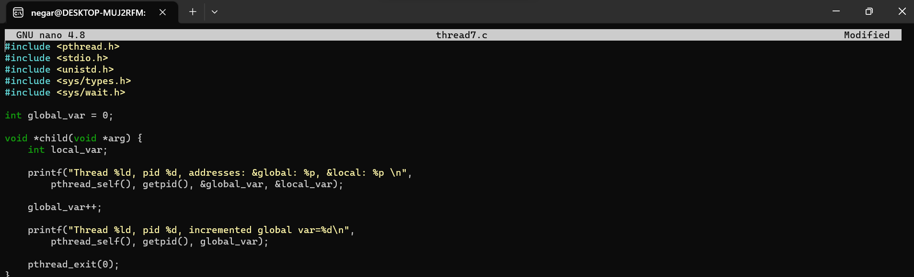

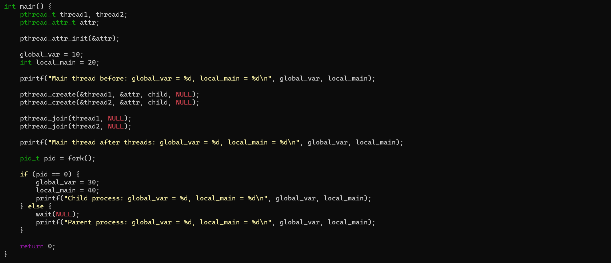

    - [ ] 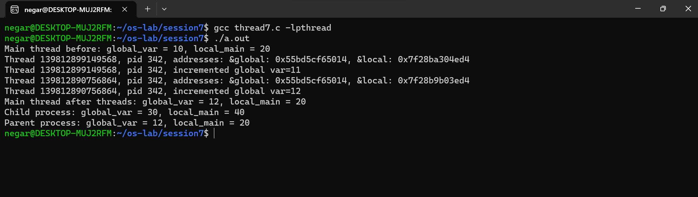

- همان طور که مشاهده می‌شود مقادیر متغیرهای لوکال و گلوبال در پردازه‌ی پدر و فرزند متفاوت هستند. یعنی فرزند کپی خودش را از این متتغیرها نگه می‌دارد و با چیزی که پدر نگه می‌دارد یکسان نیست. 

### Section 7.4.4
- [ ] Passing multiple variables
    - [ ] 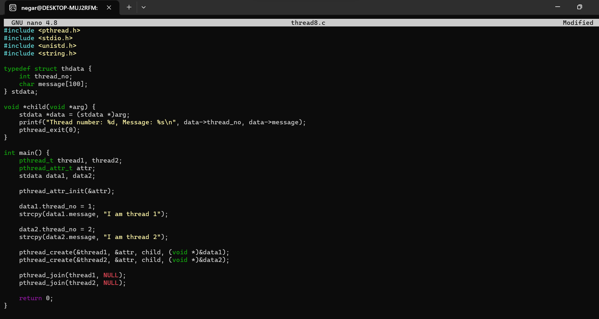

    - [ ] 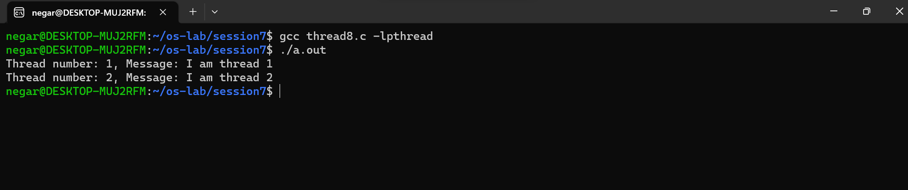
